# EsdrasProject


Configuração do Ambiente
Primeiramente, é essencial garantir que estamos utilizando versões do Node.js e NPM que sejam compatíveis e suportadas. Para isso, é necessário verificar as versões ativamente suportadas conforme indicado na documentação oficial do Angular em Angular.dev.

Siga os passos abaixo para configurar seu ambiente:


## Ambiente de desenvolvimento
Para verificar a versão do Node.js instalada localmente em sua máquina, você pode executar o seguinte comando no terminal:

Pra esse projeto e setup usei  essas versoes, recomendo usar o nvm pra facilitar a troca
[nvm](https://github.com/nvm-sh/nvm)
```bash
node --version v20.12.1
npm --version 
pnpm --version 8.15.6
```

Instalar o angular cli na versão mais recente.
recomendo desistalar a versão na maquina
```bash
pnpm install -g @angular/cli@latest

ng version
```
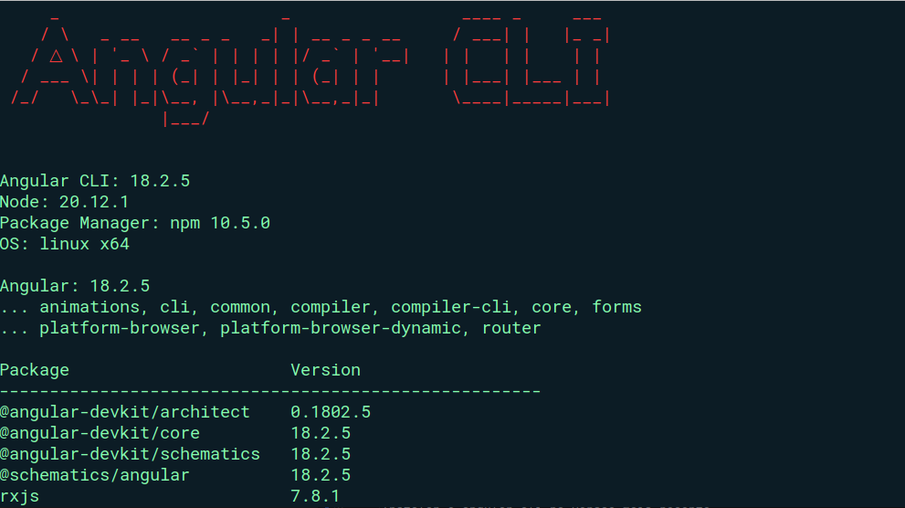
### Workspace
Criar o workspace do projeto

```bash
ng new esdras-project --create-application false --prefix esdras-khan
```

ai vai criar o workspace, com o angular.json quase vazio
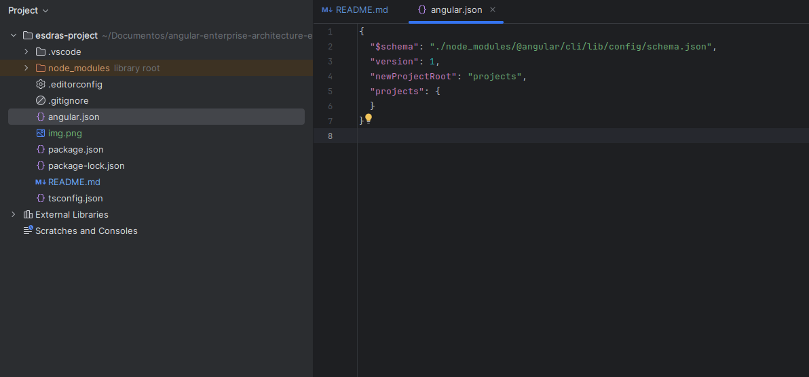

vamos colcoar o primeiro app dentro dele
colocando roteamento, estilo, e definindo se a aplicação vai ser com ssr ou não!.
```bash
ng g application frontend-school --prefix esdras-khan --routing --style=scss --strict --ssr false

```
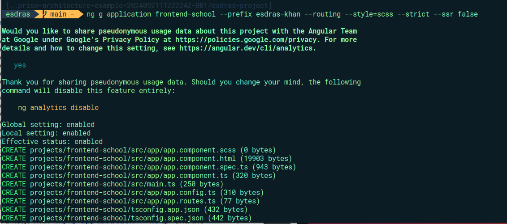
com isso nosso project ja esta criado
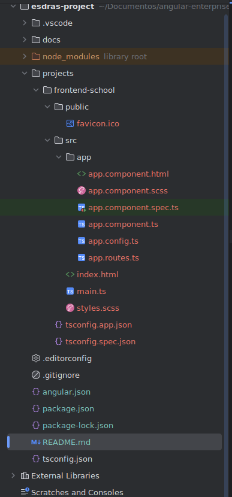

### Schematics
Para garantir que todos os novos componentes criados no seu projeto Angular 
sigam padrões específicos,
como o uso da estratégia de detecção de mudanças OnPush, 
você pode configurar os schematics no arquivo angular.json.
Isso não apenas otimiza a detecção de alterações, mas também 
estabelece uma prática consistente entre os desenvolvedores do projeto.

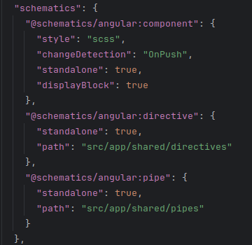

### Prettier

O Prettier é um formatador de código opinativo que garante uniformidade na
apresentação do código em todo o seu projeto. Isso elimina a necessidade de 
discussões sobre estilo de código entre os desenvolvedores e 
permite que a equipe concentre seus esforços na lógica do código.
Usar o Prettier ajuda a manter a base de código limpa e consistente, 
facilitando a leitura e manutenção por qualquer pessoa do time.


```bash
pnpm  install -D prettier
```
crie dois arquivos um .prettierrc e um .prettierignore
e coloque essa config pro prettier
```json


{
  "singleQuote": true,
  "tabWidth": 2,
  "printWidth": 120
}
```
pro ignore
```json 
# Add files here to ignore them from prettier formatting
dist
coverage
.angular
package-lock.json
docs
package-lock.yaml

```


depois de instalar, configure no seu webstorm ou vs code

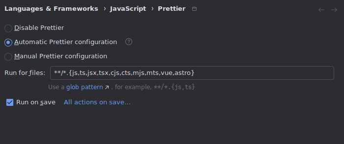
Com o Prettier configurado no seu IDE de escolha, 
é uma boa prática adicionar scripts de formatação no
package.json do seu projeto. 
Isso permite formatar o código facilmente ou verificar se tudo 
está formatado corretamente em todo o workspace. 
Aqui está como você pode fazer isso:

```json
"scripts": {
  "format:test": "prettier --list-different \"./projects/**/*.{ts,html,scss,json}\"",
  "format:write": "prettier --write \"./projects/**/*.{ts,html,scss,json}\""
}
```

#### Explicação dos Scripts
format:test: Este script usa o comando --list-different do Prettier para listar os arquivos que não estão formatados corretamente de acordo com as regras definidas. Se houver arquivos que precisam de formatação, eles serão exibidos no terminal.

format:write: Este script usa o comando --write para automaticamente formatar todos os arquivos especificados no padrão do caminho.


#### Integração com Sistema de Controle de Versão

Para uma integração ainda mais eficiente, utilizei o husky
Isso permite que a formatação seja automaticamente
aplicada a arquivos modificados no momento do commit, 
garantindo que todo código comitado siga as convenções de estilo.

```bash 
pnpm add --save-dev husky
pnpm add --save-dev husky
```
ai se cria um pasta chamada pre-commit, onde coloquei o comando de formatar
aqui da pra usar muito mais comandos
```json
npm run format:write
```

### Tamanho de pacote e build
Uma coisa que nunca parava pra pensar, em questão de frontend, era o tamanho do pacote,
sempre pensava em questão colocar lazy loading nos modulos, mas nunca olhava ferramentas que poderia me ajudar
em questão de analise do tamanho dos pacotes de uma aplicação no frontend, em pesquisas descobri 3 ferramentas
que que podem ser usadas para analisar o tamanho do pacote:

1. esbuild-visualizer: Bom para quem usa esbuild. Ele cria uns arquivos que precisam de um servidor tipo HTTP para você ver o que está acontecendo. Dá para ver tudo em formatos diferentes, como treemap, que é o mais comum.
2. source-map-explorer
   Adequado para: Qualquer projeto que produza mapas de fonte, mas é mais simples e não tão bonito quanto outros. 
3. webpack-bundle-analyzer :É a mais usada, mas só vale para quem não tá no esbuild. Se seu projeto é antigo e usa webpack, essa é a ferramenta.

Essas ferramentas ajudam a manter a eficiência de sua aplicação ao permitir uma gestão cuidadosa do tamanho do pacote, essencial para otimizar os tempos de carga e melhorar a experiência geral de desenvolvimento.


vamos usar o esbuild e o source-map-explorer

```bash
pnpm install -D esbuild-visualizer source-map-explorer http-server
```

```bash
"analyze": "ng build --stats-json --output-hashing=none --named-chunks && esbuild-visualizer --template treemap --metadata dist/frontend-school/stats.json --filename dist/frontend-school/analyse/index.html  && http-server -o -c-1 ./dist/frontend-school/analyse/",
"analyze:sme": "ng build --source-map --output-hashing=none --named-chunks && source-map-explorer dist/frontend-school/browser/*.js --html dist/frontend-school/sme/index.html && http-server -o -c-1 ./dist/frontend-school/sme/",

```

Como podem ver, utilizamos um http server pra visualizar o tamanho dos arquivos incluidos no pacote e identificar quais modulos que são mais pesados.
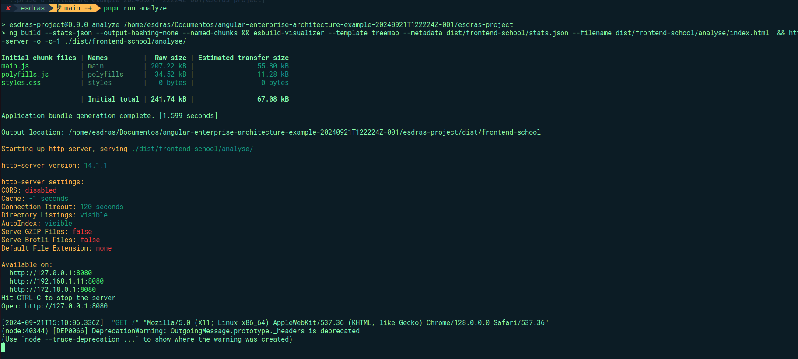
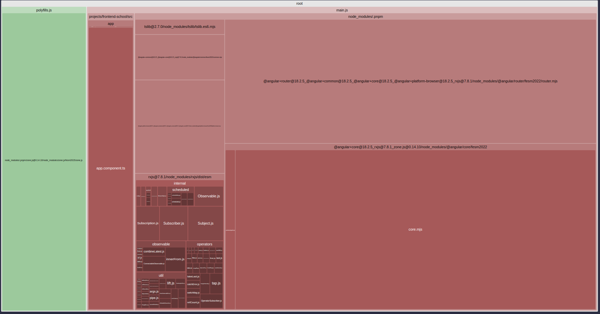

conseguimos ver o source mapper, com o tamanho do bundle da aplicação
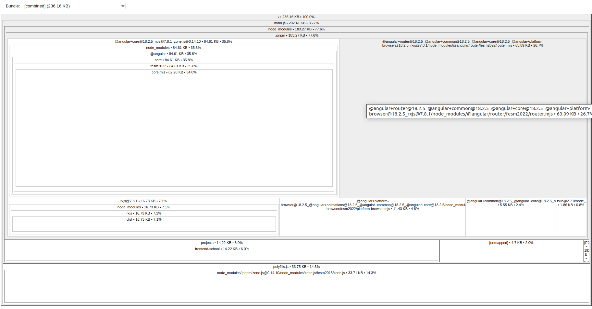
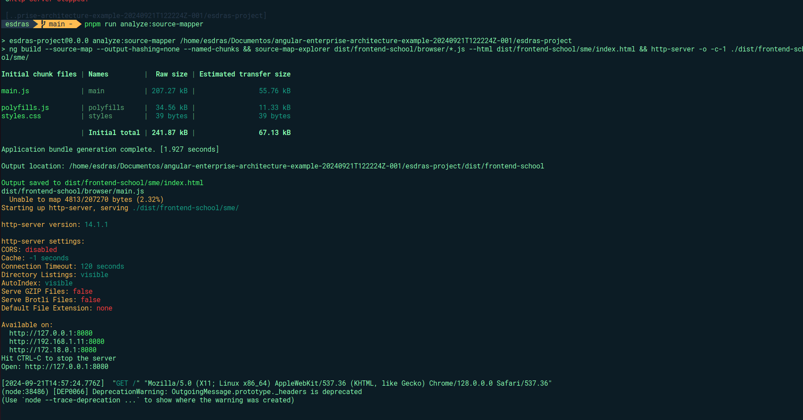

Ele é mais limitado em termos de visualizações interativas e recursos adicionais,
focando-se principalmente na exibição dos componentes do pacote com base nos mapas de fonte existentes.

enquanto o esbuild, gera um arquivo que pode ser visualizado tbm depois, pra identificarmos possiveis melhorias no tamanho do bundle
pelo site [analyze](https://esbuild.github.io/analyze/)

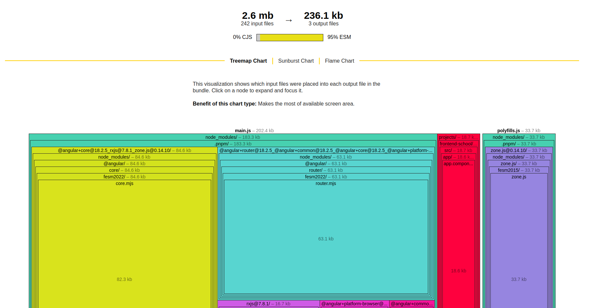

recomendo esses outros artigos que usei pra estudar, e que são excelentes.
[Fabio Zuin](https://medium.com/@fabiozuin/performance-you-should-keep-an-eye-on-your-bundle-constantly-and-here-is-how-40f0c00a64fb)
[Mohammedfahimullah ](https://mohammedfahimullah.medium.com/optimize-the-bundle-size-using-source-map-explorer-5e848850e578)
[Tim Deschryver](https://timdeschryver.dev/bits/optimize-your-bundle-size-with-source-map-explorer)
[Tomas Trajan](https://angularexperts.io/blog/top-10-angular-architecture-mistakes)
[Webpack Bundle](https://blog.jakoblind.no/webpack-bundle-analyzer/)
[Rose Waitherero Chege](https://www.debugbear.com/blog/webpack-bundle-analyzer)
[Matti Bar-Zeev](https://dev.to/mbarzeev/everything-you-need-to-know-about-webpacks-bundle-analyzer-g0l)


### Eslint
O ESLint é uma ferramenta de linting popular para códigos JavaScript e TypeScript.Ajuda os desenvolvedores
a identificar e corrigir problemas no código, como erros de sintaxe ou padrões 
de codificação que não seguem as melhores práticas. Mantendo o padrão 
em projetos grandes ou quando várias pessoas estão trabalhando no mesmo projeto. So que o eslint não 
vem integrado por padrão no Angular CLI, so que é muito 
facil adicionar e configurar o usando Angular schematics, que automatizam o processo de instalação
e configuração inicial.

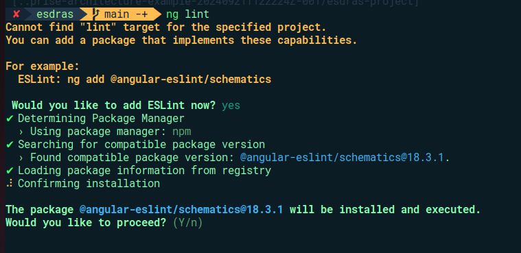
