# EsdrasProject

Configuração do Ambiente
Primeiramente, é essencial garantir que estamos utilizando versões do Node.js e NPM que sejam compatíveis e suportadas. Para isso, é necessário verificar as versões ativamente suportadas conforme indicado na documentação oficial do Angular em Angular.dev.

Siga os passos abaixo para configurar seu ambiente:

## Ambiente de desenvolvimento

Para verificar a versão do Node.js instalada localmente em sua máquina, você pode executar o seguinte comando no terminal:

Pra esse projeto e setup usei essas versoes, recomendo usar o nvm pra facilitar a troca
[nvm](https://github.com/nvm-sh/nvm)

```bash
node --version v20.12.1
npm --version 
pnpm --version 8.15.6
```

Instalar o angular cli na versão mais recente.
recomendo desistalar a versão na maquina

```bash
pnpm install -g @angular/cli@latest

ng version
```


### Workspace

Criar o workspace do projeto

```bash
ng new esdras-project --create-application false --prefix esdras-khan
```

ai vai criar o workspace, com o angular.json quase vazio


vamos colcoar o primeiro app dentro dele
colocando roteamento, estilo, e definindo se a aplicação vai ser com ssr ou não!.

```bash
ng g application frontend-school --prefix esdras-khan --routing --style=scss --strict --ssr false

```


com isso nosso project ja esta criado


### Schematics

Para garantir que todos os novos componentes criados no seu projeto Angular
sigam padrões específicos,
como o uso da estratégia de detecção de mudanças OnPush,
você pode configurar os schematics no arquivo angular.json.
Isso não apenas otimiza a detecção de alterações, mas também
estabelece uma prática consistente entre os desenvolvedores do projeto.


### Prettier

O Prettier é um formatador de código opinativo que garante uniformidade na
apresentação do código em todo o seu projeto. Isso elimina a necessidade de
discussões sobre estilo de código entre os desenvolvedores e
permite que a equipe concentre seus esforços na lógica do código.
Usar o Prettier ajuda a manter a base de código limpa e consistente,
facilitando a leitura e manutenção por qualquer pessoa do time.

```bash
pnpm  install -D prettier
```

crie dois arquivos um .prettierrc e um .prettierignore
e coloque essa config pro prettier

```json


{
  "singleQuote": true,
  "tabWidth": 2,
  "printWidth": 120
}
```

pro ignore

```json 
# Add files here to ignore them from prettier formatting
dist
coverage
.angular
package-lock.json
docs
package-lock.yaml

```

depois de instalar, configure no seu webstorm ou vs code


Com o Prettier configurado no seu IDE de escolha,
é uma boa prática adicionar scripts de formatação no
package.json do seu projeto.
Isso permite formatar o código facilmente ou verificar se tudo
está formatado corretamente em todo o workspace.
Aqui está como você pode fazer isso:

```json
"scripts": {
"format:test": "prettier --list-different \"./projects/**/*.{ts,html,scss,json}\"",
"format:write": "prettier --write \"./projects/**/*.{ts,html,scss,json}\""
}
```

#### Explicação dos Scripts

format:test: Este script usa o comando --list-different do Prettier para listar os arquivos que não estão formatados corretamente de acordo com as regras definidas. Se houver arquivos que precisam de formatação, eles serão exibidos no terminal.

format:write: Este script usa o comando --write para automaticamente formatar todos os arquivos especificados no padrão do caminho.

#### Integração com Sistema de Controle de Versão

Para uma integração ainda mais eficiente, utilizei o husky
Isso permite que a formatação seja automaticamente
aplicada a arquivos modificados no momento do commit,
garantindo que todo código comitado siga as convenções de estilo.

```bash 
pnpm add --save-dev husky
pnpm add --save-dev husky
```

ai se cria um pasta chamada pre-commit, onde coloquei o comando de formatar
aqui da pra usar muito mais comandos

```json
npm run format:write
```

### Tamanho de pacote e build

Uma coisa que nunca parava pra pensar, em questão de frontend, era o tamanho do pacote,
sempre pensava em questão colocar lazy loading nos modulos, mas nunca olhava ferramentas que poderia me ajudar
em questão de analise do tamanho dos pacotes de uma aplicação no frontend, em pesquisas descobri 3 ferramentas
que que podem ser usadas para analisar o tamanho do pacote:

1. esbuild-visualizer: Bom para quem usa esbuild. Ele cria uns arquivos que precisam de um servidor tipo HTTP para você ver o que está acontecendo. Dá para ver tudo em formatos diferentes, como treemap, que é o mais comum.
2. source-map-explorer
   Adequado para: Qualquer projeto que produza mapas de fonte, mas é mais simples e não tão bonito quanto outros.
3. webpack-bundle-analyzer :É a mais usada, mas só vale para quem não tá no esbuild. Se seu projeto é antigo e usa webpack, essa é a ferramenta.

Essas ferramentas ajudam a manter a eficiência de sua aplicação ao permitir uma gestão cuidadosa do tamanho do pacote, essencial para otimizar os tempos de carga e melhorar a experiência geral de desenvolvimento.

vamos usar o esbuild e o source-map-explorer

```bash
pnpm install -D esbuild-visualizer source-map-explorer http-server
```

```bash
"analyze": "ng build --stats-json --output-hashing=none --named-chunks && esbuild-visualizer --template treemap --metadata dist/frontend-school/stats.json --filename dist/frontend-school/analyse/index.html  && http-server -o -c-1 ./dist/frontend-school/analyse/",
"analyze:sme": "ng build --source-map --output-hashing=none --named-chunks && source-map-explorer dist/frontend-school/browser/*.js --html dist/frontend-school/sme/index.html && http-server -o -c-1 ./dist/frontend-school/sme/",

```

Como podem ver, utilizamos um http server pra visualizar o tamanho dos arquivos incluidos no pacote e identificar quais modulos que são mais pesados.


conseguimos ver o source mapper, com o tamanho do bundle da aplicação


Ele é mais limitado em termos de visualizações interativas e recursos adicionais,
focando-se principalmente na exibição dos componentes do pacote com base nos mapas de fonte existentes.

enquanto o esbuild, gera um arquivo que pode ser visualizado tbm depois, pra identificarmos possiveis melhorias no tamanho do bundle
pelo site [analyze](https://esbuild.github.io/analyze/)


recomendo esses outros artigos que usei pra estudar, e que são excelentes.
[Fabio Zuin](https://medium.com/@fabiozuin/performance-you-should-keep-an-eye-on-your-bundle-constantly-and-here-is-how-40f0c00a64fb)
[Mohammedfahimullah ](https://mohammedfahimullah.medium.com/optimize-the-bundle-size-using-source-map-explorer-5e848850e578)
[Tim Deschryver](https://timdeschryver.dev/bits/optimize-your-bundle-size-with-source-map-explorer)
[Tomas Trajan](https://angularexperts.io/blog/top-10-angular-architecture-mistakes)
[Webpack Bundle](https://blog.jakoblind.no/webpack-bundle-analyzer/)
[Rose Waitherero Chege](https://www.debugbear.com/blog/webpack-bundle-analyzer)
[Matti Bar-Zeev](https://dev.to/mbarzeev/everything-you-need-to-know-about-webpacks-bundle-analyzer-g0l)

### Eslint

O ESLint é uma ferramenta de linting popular para códigos JavaScript e TypeScript.Ajuda os desenvolvedores
a identificar e corrigir problemas no código, como erros de sintaxe ou padrões
de codificação que não seguem as melhores práticas. Mantendo o padrão
em projetos grandes ou quando várias pessoas estão trabalhando no mesmo projeto. So que o eslint não
vem integrado por padrão no Angular CLI, so que é muito
facil adicionar e configurar o usando Angular schematics, que automatizam o processo de instalação
e configuração inicial.


No webstorm pra configurar
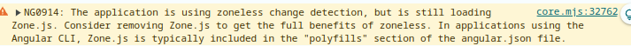

É o eslint ajuda pra caramba, nesse caso que eu implementei um lifecycle do componente
e não coloquei nada, ele ja apita que tem erro.
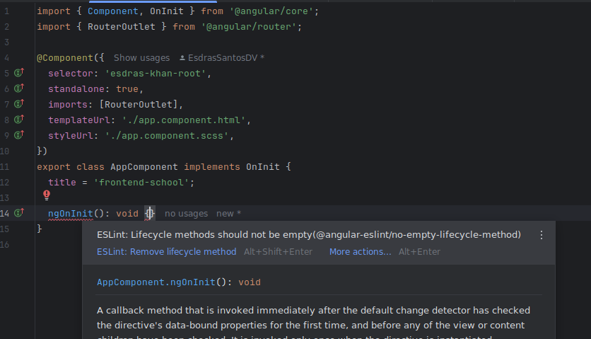

### Tamanho de pacote e build

Uma coisa que nunca parava pra pensar, em questão de frontend, era o tamanho do pacote,
sempre pensava em questão colocar lazy loading nos modulos, mas nunca olhava ferramentas que poderia me ajudar
em questão de analise do tamanho dos pacotes de uma aplicação no frontend, em pesquisas descobri 3 ferramentas
que que podem ser usadas para analisar o tamanho do pacote:

1. esbuild-visualizer: Bom para quem usa esbuild. Ele cria uns arquivos que precisam de um servidor tipo HTTP para você ver o que está acontecendo. Dá para ver tudo em formatos diferentes, como treemap, que é o mais comum.
2. source-map-explorer
   Adequado para: Qualquer projeto que produza mapas de fonte, mas é mais simples e não tão bonito quanto outros.
3. webpack-bundle-analyzer :É a mais usada, mas só vale para quem não tá no esbuild. Se seu projeto é antigo e usa webpack, essa é a ferramenta.

Essas ferramentas ajudam a manter a eficiência de sua aplicação ao permitir uma gestão cuidadosa do tamanho do pacote, essencial para otimizar os tempos de carga e melhorar a experiência geral de desenvolvimento.

vamos usar o esbuild e o source-map-explorer

```bash
pnpm install -D esbuild-visualizer source-map-explorer http-server
```

```bash
"analyze": "ng build --stats-json --output-hashing=none --named-chunks && esbuild-visualizer --template treemap --metadata dist/frontend-school/stats.json --filename dist/frontend-school/analyse/index.html  && http-server -o -c-1 ./dist/frontend-school/analyse/",
"analyze:sme": "ng build --source-map --output-hashing=none --named-chunks && source-map-explorer dist/frontend-school/browser/*.js --html dist/frontend-school/sme/index.html && http-server -o -c-1 ./dist/frontend-school/sme/",

```

Como podem ver, utilizamos um http server pra visualizar o tamanho dos arquivos incluidos no pacote e identificar quais modulos que são mais pesados.


conseguimos ver o source mapper, com o tamanho do bundle da aplicação


Ele é mais limitado em termos de visualizações interativas e recursos adicionais,
focando-se principalmente na exibição dos componentes do pacote com base nos mapas de fonte existentes.

enquanto o esbuild, gera um arquivo que pode ser visualizado tbm depois, pra identificarmos possiveis melhorias no tamanho do bundle
pelo site [analyze](https://esbuild.github.io/analyze/)

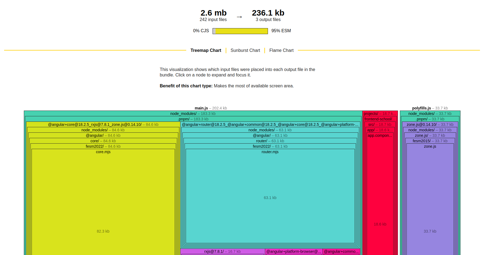

recomendo esses outros artigos que usei pra estudar, e que são excelentes.
[Fabio Zuin](https://medium.com/@fabiozuin/performance-you-should-keep-an-eye-on-your-bundle-constantly-and-here-is-how-40f0c00a64fb)
[Mohammedfahimullah ](https://mohammedfahimullah.medium.com/optimize-the-bundle-size-using-source-map-explorer-5e848850e578)
[Tim Deschryver](https://timdeschryver.dev/bits/optimize-your-bundle-size-with-source-map-explorer)
[Tomas Trajan](https://angularexperts.io/blog/top-10-angular-architecture-mistakes)
[Webpack Bundle](https://blog.jakoblind.no/webpack-bundle-analyzer/)
[Rose Waitherero Chege](https://www.debugbear.com/blog/webpack-bundle-analyzer)
[Matti Bar-Zeev](https://dev.to/mbarzeev/everything-you-need-to-know-about-webpacks-bundle-analyzer-g0l)

### Eslint

O ESLint é uma ferramenta de linting popular para códigos JavaScript e TypeScript.Ajuda os desenvolvedores
a identificar e corrigir problemas no código, como erros de sintaxe ou padrões
de codificação que não seguem as melhores práticas. Mantendo o padrão
em projetos grandes ou quando várias pessoas estão trabalhando no mesmo projeto. So que o eslint não
vem integrado por padrão no Angular CLI, so que é muito
facil adicionar e configurar o usando Angular schematics, que automatizam o processo de instalação
e configuração inicial.


<<<<<<< HEAD
=======

No webstorm pra configurar
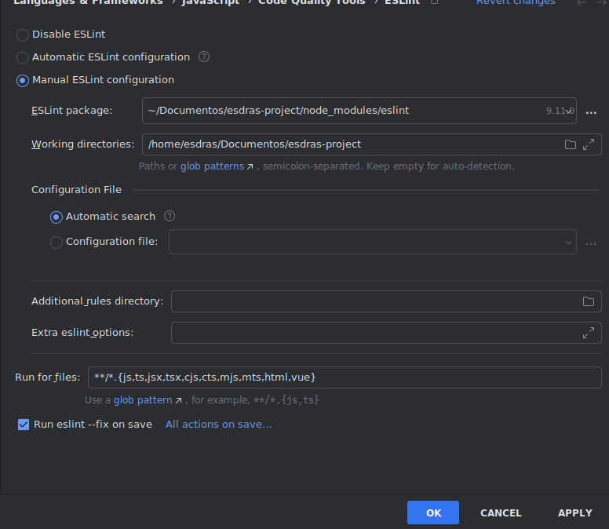

É o eslint ajuda pra caramba, nesse caso que eu implementei um lifecycle do componente


### Dependencias

A análise de grafo de dependência serve
para garantir que as dependências entre
módulos de um projeto sigam uma direção única,
sem criar loops ou ciclos.
Isso ajuda a manter o código organizado ,
fácil de manter e com menos risco de
erros ao adicionar ou modificar partes do sistema.

Pra isso vamos usar uma ferramenta que tem bastante adoção por meio da comunidade que é o
[madge](https://www.npmjs.com/package/madge)

pra instalar ela

```
pnpm i -D madge npm-run-all
```

e instalar no linux

```
sudo apt-get install graphviz

```

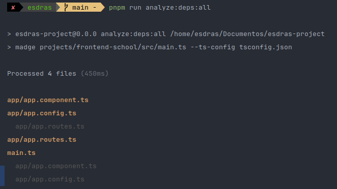

### Angular material

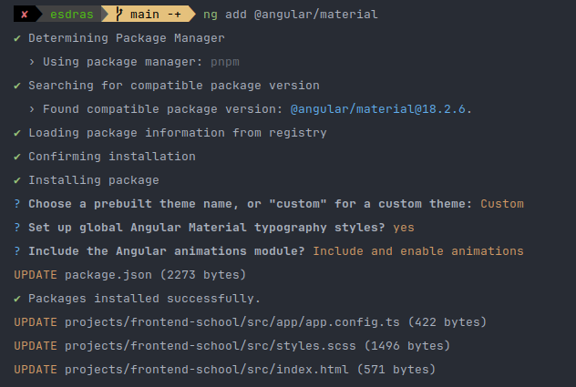

temos o builder
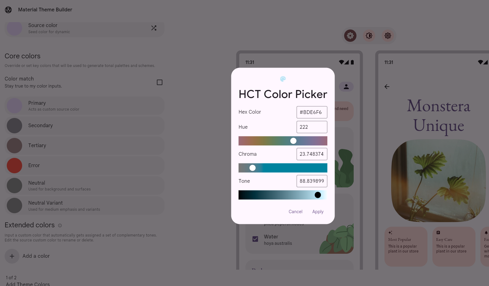

### Tailwind

``` bash
pnpm install -D tailwindcss postcss autoprefixer
```

Inicializar o tailwind

```bash
npx tailwindcss init -p
```

## Arquitetura

### Core

Na arquitetura que defini, o core é o centro da lógica compartilhada de serviços e o lugar responsável por manter a configuração e a lógica de um projeto Angular. Ele é acessível por qualquer parte das features da nossa aplicação, seja carregada de forma eager ou lazy.

Imagine, por exemplo, uma feature de pedidos que precisa buscar informações do backend ou acessar uma store específica. Nesse caso, o core desempenha um papel fundamental, fornecendo a lógica necessária para essa busca de dados. O core é o local onde concentramos nossos singletons, stores e a lógica de configuração do projeto.

Uma das principais responsabilidades do core é garantir que toda a lógica necessária para o funcionamento da aplicação desde o início, como estado de autenticação, interceptores e guards, esteja configurada corretamente. Essa lógica pode ser usada para realizar outras requisições backend, determinar o acesso de usuários a determinadas partes da aplicação ou até exibir informações antes mesmo do carregamento de uma funcionalidade lazy.

Além disso, o core é onde implementamos lógicas de domínio, especialmente quando essa lógica precisa ser compartilhada entre múltiplas features. Por exemplo, se temos um caso em que precisamos construir factories de dados, essa lógica também reside no core, permitindo que qualquer parte da aplicação consuma essas factories de maneira eficiente e centralizada.

Portanto, o core vai além de um simples agrupamento de serviços; ele é o ponto central de configuração, gerenciamento de estado e lógica compartilhada, assegurando que todos os recursos essenciais estejam disponíveis em toda a aplicação de forma consistente e escalável.

#Core

Com a estrutura standalone, o core torna-se ainda mais essencial, substituindo o antigo CoreModule pelo provideCore(), permitindo um gerenciamento muito mais eficiente das configurações que devem estar ativas desde o início da aplicação. O provideCore() é o local ideal para concentrar todas essas configurações essenciais, garantindo que tudo esteja centralizado, sem ambiguidade ou risco de omitir alguma configuração importante.

O provideCore() centraliza a configuração de todos os provedores globais do Angular, como provideAnimations(), provideRouter(), provideHttpClient() (com interceptores) e também bibliotecas de gerenciamento de estado, como o NgRx, através do provideStore(). APIs do tipo provideX também suportam configurações adicionais, permitindo personalizações que aprimoram as funcionalidades fornecidas.

Além disso, o provideCore() é o local ideal para registrar provedores de bibliotecas de terceiros que tratam de aspectos cruciais de infraestrutura, como logging, traduções, análises e outros serviços essenciais para a operação da aplicação. Com essa abordagem standalone, a organização e centralização dessas configurações tornam-se muito mais eficientes, unificando toda a lógica de infraestrutura.

Colocando a configuração de zoneless no angular

```ts
export function provideCore({ routes }: CoreOptions) {
  return [
    provideExperimentalZonelessChangeDetection(),

```

so que recebmos um erro no navegador, dizendo que precisamos remover o zone.js do polyfil

precisamos remover o zones js do polyfil

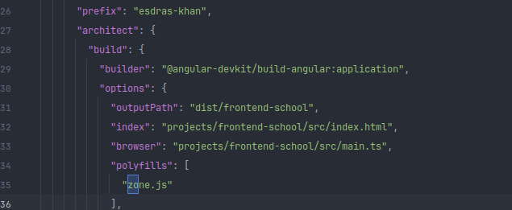

### Transloco

``` bash
ng add @jsverse/transloco
```

e configurar no core as linguagens, podemos tambem fazer um setup de companhias
e cada companhia ter o seu determinado texto
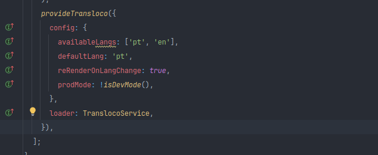

### NGRX

```bash
 ng add @ngrx/store@latest    
 ng add @ngrx/store-devtools@latest
 ng add @ngrx/signals@latest
 ng add @ngrx/operators@latest
 ng add @ngrx/eslint-plugin
 ng add @ngrx/schematics@latest
 ng add @ngrx/router-store@latest
```

gosto dessas configuraçoes

```ts
  provideStore(),
  provideStoreDevtools({
    maxAge: 25,
    logOnly: !isDevMode(),
    autoPause: true,
    trace: true,
    traceLimit: 75,
  }),
  provideRouterStore(),
```

### Keycloak Angular

ter um ambiente com o keycloak, nesse caso, usei um docker pra subir o keycloak
e configurei o realm e o client no keycloak, coloquei uma pasta na raiz desse projeto
com um compose, pra subir o keycloak, peguei na propria documentação do keycloak angular,
posteriormente, realizarei um artigo sobre como subir o keycloak pra nuvem

```docker
version: '3'
services:
  keycloak:
    image: quay.io/keycloak/keycloak:25.0.0
    environment:
      KEYCLOAK_ADMIN: admin
      KEYCLOAK_ADMIN_PASSWORD: admin
    ports:
      - 8080:8080
    volumes:
      - ./config/:/opt/keycloak/data/import:ro
    entrypoint: '/opt/keycloak/bin/kc.sh start-dev --import-realm'
```

depois disso abrir o localhost:8080 e logar com o admin e a senha admin
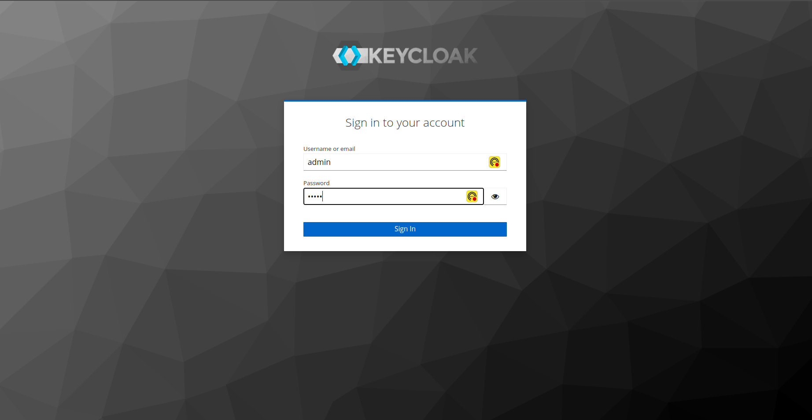

entramos na tela de configuração do keycloak

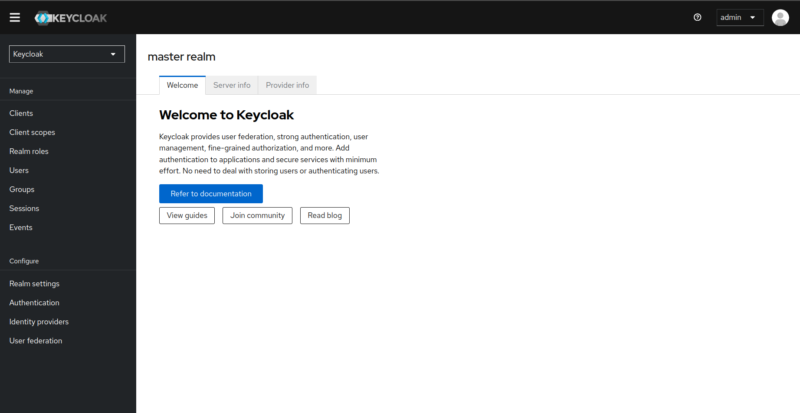

vamos criar nosso reino

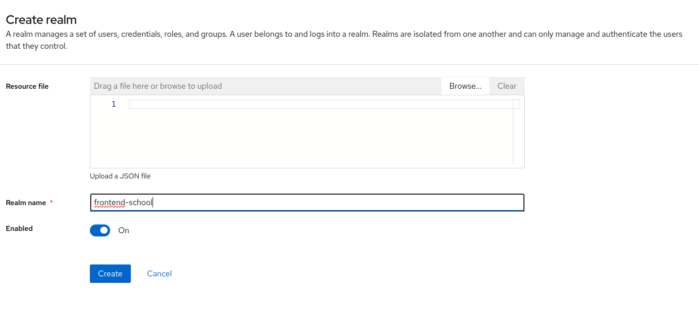
na opcao do menu a direita, vamos em add realm

depois disso, nos criamos nosso client, e salvamos nosso client id pra posteriormente
configurar no frontend
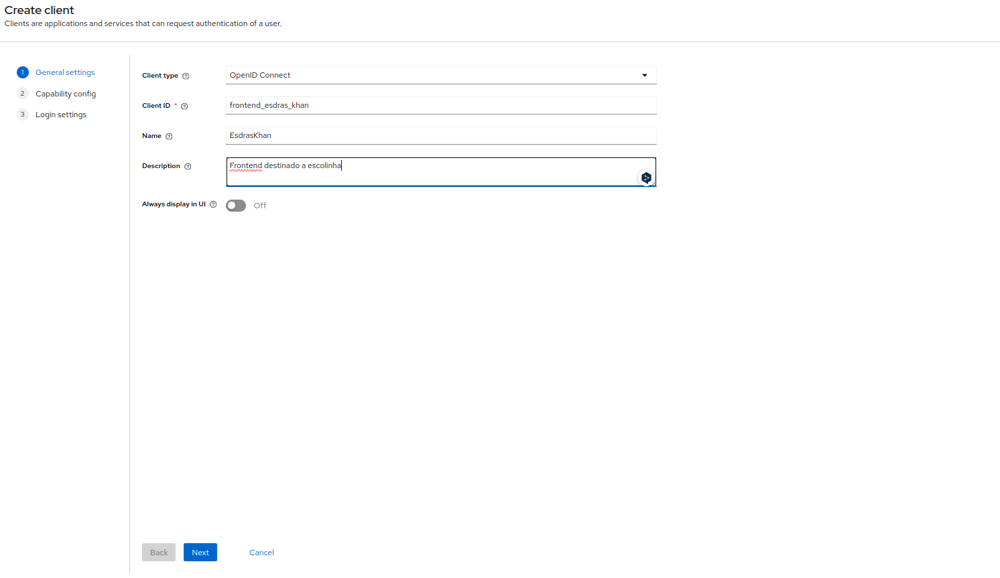
deixamos por padrão
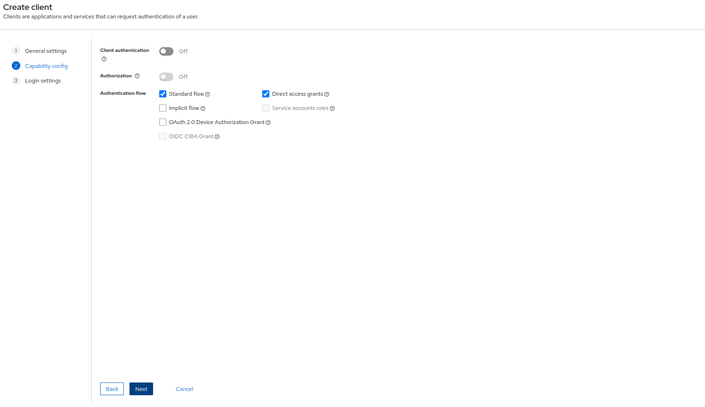

colocamos as url de redirecionamento

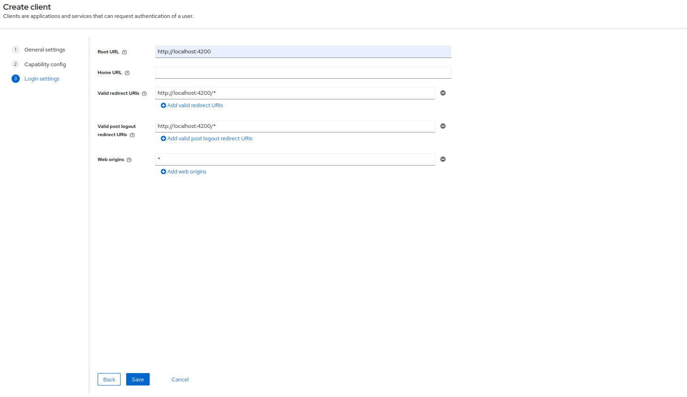

criar o usuario

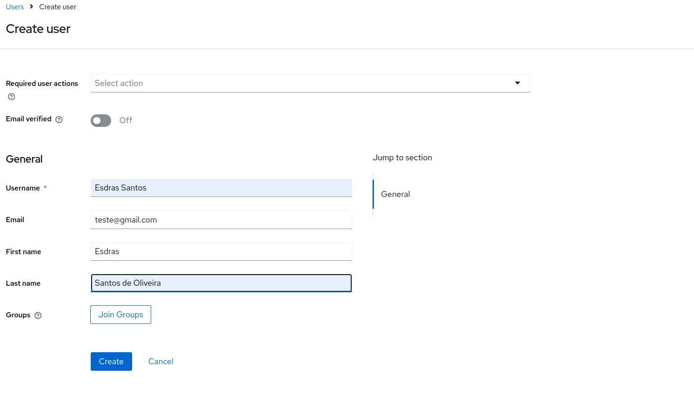

colocar a senha
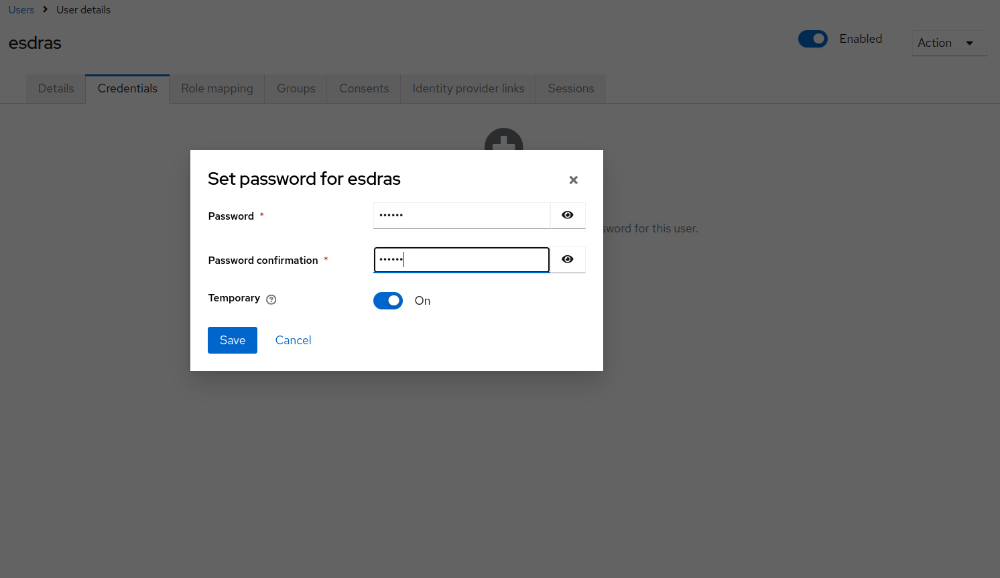

```bash
pnpm  i keycloak-angular
pnpm i keycloak-js

```

depois de instalar e so criar um arquivo html na pasta assets

```html

<html>
<body>
<script>
  parent.postMessage(location.href, location.origin);
</script>
</body>
</html>
```

e configurar o init do keycloak

```ts
import { KeycloakService } from 'keycloak-angular';
import { environment } from '../../../environments/environment';

export function initializeKeycloak(keycloak: KeycloakService) {
  return async () =>
    keycloak.init({
      config: {
        url: environment.keycloak.authority,
        realm: environment.keycloak.realm,
        clientId: environment.keycloak.clientId,
      },
      loadUserProfileAtStartUp: true,
      initOptions: {
        onLoad: 'check-sso',
        silentCheckSsoRedirectUri: window.location.origin + '/silent-check-sso.html',
        checkLoginIframe: false,
        redirectUri: environment.keycloak.redirectUri,
      },
    });
}

```

depois
quando
rodar
o
projeto, pedira
pra
logar, e
depois
de
logar, vai
redirecionar
pra
pagina
principal

vi
alguns
desenvolvedores
tendo
dificuldade
em
configurar
o
keycloak, com
standalone,
o
segredo
e
pra
nessas
situaçoes
que
exigirem
modulos
colocar
o
importProvidersFrom

  ``` tipescript
 importProvidersFrom([KeycloakAngularModule]),
    {
      provide: APP_INITIALIZER,
      useFactory: initializeKeycloak,
      multi: true,
      deps: [KeycloakService],
    },
```

e temos um serviço construido

```ts
import { inject, Injectable } from '@angular/core';
import { KeycloakService } from 'keycloak-angular';
import { KeycloakProfile } from 'keycloak-js';
import { environment } from '../../../environments/environment';

@Injectable({
  providedIn: 'root',
})
export class AuthKeycloakService {
  readonly keycloakService = inject(KeycloakService);

  redirectToLoginPage(): Promise<void> {
    return this.keycloakService.login();
  }

  getUserName() {
    return this.keycloakService.getUsername();
  }

  async loadUserProfile(): Promise<KeycloakProfile> {
    return await this.keycloakService.loadUserProfile();
  }

  isLoggedIn(): boolean {
    return this.keycloakService.isLoggedIn();
  }

  logout(): void {
    this.keycloakService.logout(environment.keycloak.postLogoutRedirectUri);
  }
}
```

### Setup simples de variaveis de ambiente

criar no source do projeto um arquivo de enviroment de prod, e de dev, depois vou ensinar como
fazer o ci e cd, e subir na nuvem

```ts
//DEV
export const environment = {
  production: true,
  keycloak: {
    authority: 'http://localhost:8080',
    redirectUri: 'http://localhost:4200',
    postLogoutRedirectUri: 'http://localhost:4200/logout',
    realm: 'frontend-school',
    clientId: 'frontend_esdras_khan',
  },
};
//PROD
export const environment = {
  production: true,
  keycloak: {
    authority: 'PRODUCTION',
    redirectUri: 'PRODUCTION',
    postLogoutRedirectUri: 'PRODUCTION',
    realm: 'PRODUCTION',
    clientId: 'PRODUCTION',
  },
};
```

e lembrar de colocar no angular.json

```json
   "development": {
"optimization": false,
"extractLicenses": false,
"sourceMap": true,
"fileReplacements": [
{
"replace": "projects/frontend-school/src/environments/environment.ts",
"with": "projects/frontend-school/src/environments/environment.development.ts"
}
]
}
```
