# EsdrasProject

Configuração do Ambiente
Primeiramente, é essencial garantir que estamos utilizando versões do Node.js e NPM que sejam compatíveis e suportadas. Para isso, é necessário verificar as versões ativamente suportadas conforme indicado na documentação oficial do Angular em Angular.dev.

Siga os passos abaixo para configurar seu ambiente:

## Ambiente de desenvolvimento

Para verificar a versão do Node.js instalada localmente em sua máquina, você pode executar o seguinte comando no terminal:

Pra esse projeto e setup usei essas versoes, recomendo usar o nvm pra facilitar a troca
[nvm](https://github.com/nvm-sh/nvm)

```bash
node --version v20.12.1
npm --version 
pnpm --version 8.15.6
```

Instalar o angular cli na versão mais recente.
recomendo desistalar a versão na maquina

```bash
pnpm install -g @angular/cli@latest

ng version
```

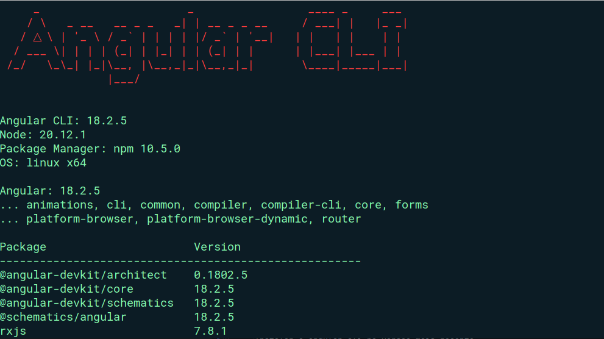

### Workspace

Criar o workspace do projeto

```bash
ng new esdras-project --create-application false --prefix esdras-khan
```

ai vai criar o workspace, com o angular.json quase vazio
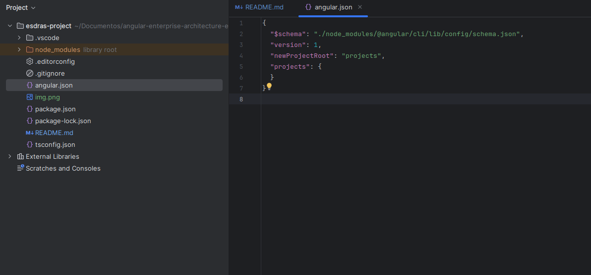

vamos colcoar o primeiro app dentro dele
colocando roteamento, estilo, e definindo se a aplicação vai ser com ssr ou não!.

```bash
ng g application frontend-school --prefix esdras-khan --routing --style=scss --strict --ssr false

```

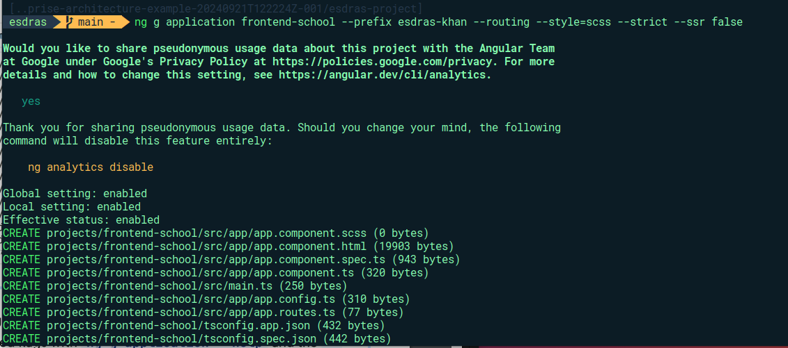
com isso nosso project ja esta criado
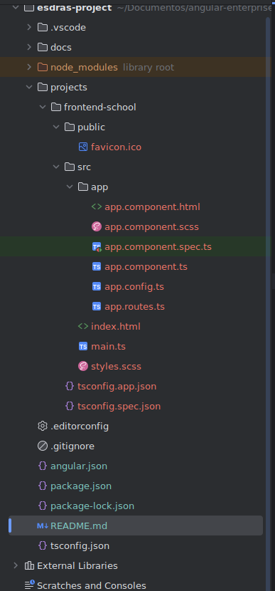

### Schematics

Para garantir que todos os novos componentes criados no seu projeto Angular
sigam padrões específicos,
como o uso da estratégia de detecção de mudanças OnPush,
você pode configurar os schematics no arquivo angular.json.
Isso não apenas otimiza a detecção de alterações, mas também
estabelece uma prática consistente entre os desenvolvedores do projeto.

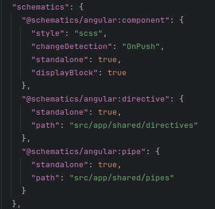

### Prettier

O Prettier é um formatador de código opinativo que garante uniformidade na
apresentação do código em todo o seu projeto. Isso elimina a necessidade de
discussões sobre estilo de código entre os desenvolvedores e
permite que a equipe concentre seus esforços na lógica do código.
Usar o Prettier ajuda a manter a base de código limpa e consistente,
facilitando a leitura e manutenção por qualquer pessoa do time.

```bash
pnpm  install -D prettier
```

crie dois arquivos um .prettierrc e um .prettierignore
e coloque essa config pro prettier

```json


{
  "singleQuote": true,
  "tabWidth": 2,
  "printWidth": 120
}
```

pro ignore

```json 
# Add files here to ignore them from prettier formatting
dist
coverage
.angular
package-lock.json
docs
package-lock.yaml

```

depois de instalar, configure no seu webstorm ou vs code

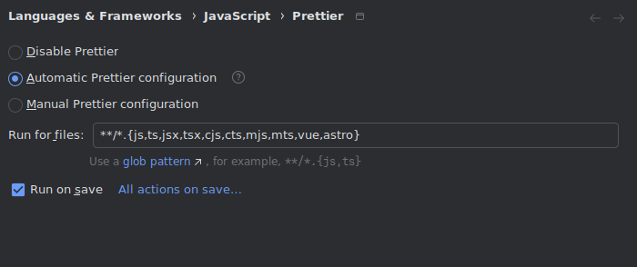
Com o Prettier configurado no seu IDE de escolha,
é uma boa prática adicionar scripts de formatação no
package.json do seu projeto.
Isso permite formatar o código facilmente ou verificar se tudo
está formatado corretamente em todo o workspace.
Aqui está como você pode fazer isso:

```json
"scripts": {
"format:test": "prettier --list-different \"./projects/**/*.{ts,html,scss,json}\"",
"format:write": "prettier --write \"./projects/**/*.{ts,html,scss,json}\""
}
```

#### Explicação dos Scripts

format:test: Este script usa o comando --list-different do Prettier para listar os arquivos que não estão formatados corretamente de acordo com as regras definidas. Se houver arquivos que precisam de formatação, eles serão exibidos no terminal.

format:write: Este script usa o comando --write para automaticamente formatar todos os arquivos especificados no padrão do caminho.

#### Integração com Sistema de Controle de Versão

Para uma integração ainda mais eficiente, utilizei o husky
Isso permite que a formatação seja automaticamente
aplicada a arquivos modificados no momento do commit,
garantindo que todo código comitado siga as convenções de estilo.

```bash 
pnpm add --save-dev husky
pnpm add --save-dev husky
```

ai se cria um pasta chamada pre-commit, onde coloquei o comando de formatar
aqui da pra usar muito mais comandos

```json
npm run format:write
```

### Tamanho de pacote e build

Uma coisa que nunca parava pra pensar, em questão de frontend, era o tamanho do pacote,
sempre pensava em questão colocar lazy loading nos modulos, mas nunca olhava ferramentas que poderia me ajudar
em questão de analise do tamanho dos pacotes de uma aplicação no frontend, em pesquisas descobri 3 ferramentas
que que podem ser usadas para analisar o tamanho do pacote:

1. esbuild-visualizer: Bom para quem usa esbuild. Ele cria uns arquivos que precisam de um servidor tipo HTTP para você ver o que está acontecendo. Dá para ver tudo em formatos diferentes, como treemap, que é o mais comum.
2. source-map-explorer
   Adequado para: Qualquer projeto que produza mapas de fonte, mas é mais simples e não tão bonito quanto outros.
3. webpack-bundle-analyzer :É a mais usada, mas só vale para quem não tá no esbuild. Se seu projeto é antigo e usa webpack, essa é a ferramenta.

Essas ferramentas ajudam a manter a eficiência de sua aplicação ao permitir uma gestão cuidadosa do tamanho do pacote, essencial para otimizar os tempos de carga e melhorar a experiência geral de desenvolvimento.

vamos usar o esbuild e o source-map-explorer

```bash
pnpm install -D esbuild-visualizer source-map-explorer http-server
```

```bash
"analyze": "ng build --stats-json --output-hashing=none --named-chunks && esbuild-visualizer --template treemap --metadata dist/frontend-school/stats.json --filename dist/frontend-school/analyse/index.html  && http-server -o -c-1 ./dist/frontend-school/analyse/",
"analyze:sme": "ng build --source-map --output-hashing=none --named-chunks && source-map-explorer dist/frontend-school/browser/*.js --html dist/frontend-school/sme/index.html && http-server -o -c-1 ./dist/frontend-school/sme/",

```

Como podem ver, utilizamos um http server pra visualizar o tamanho dos arquivos incluidos no pacote e identificar quais modulos que são mais pesados.
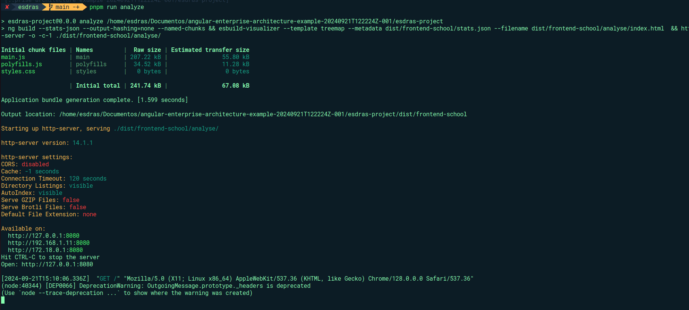
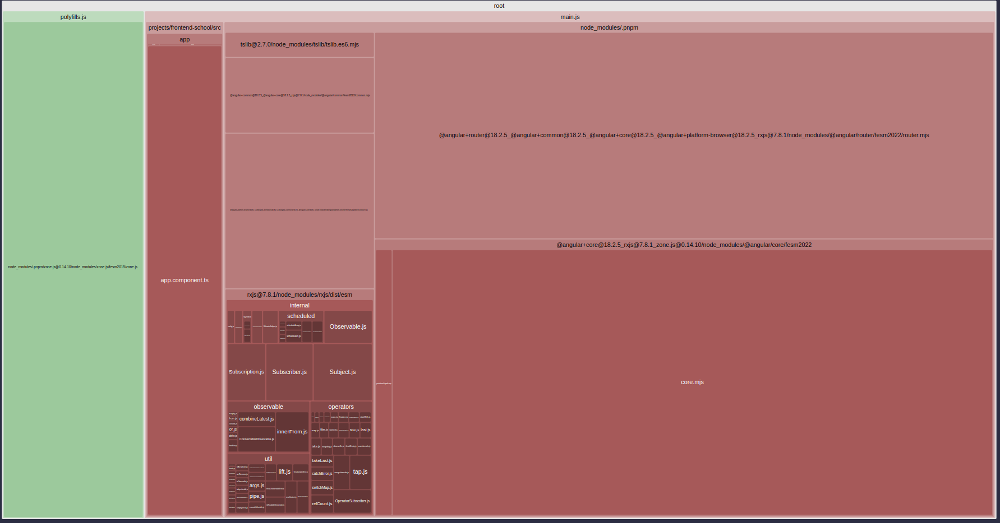

conseguimos ver o source mapper, com o tamanho do bundle da aplicação
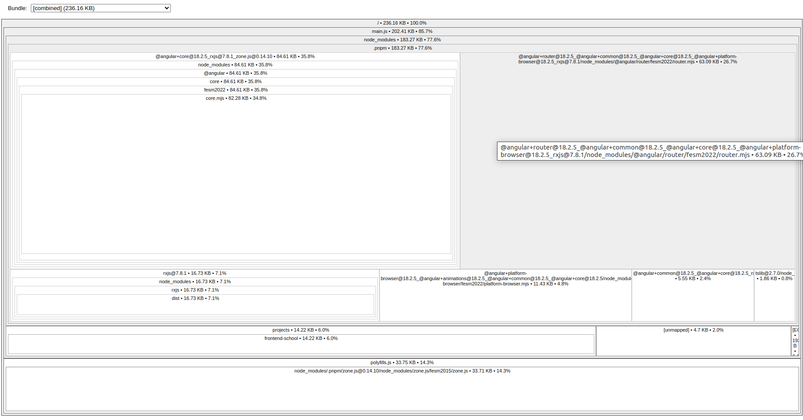
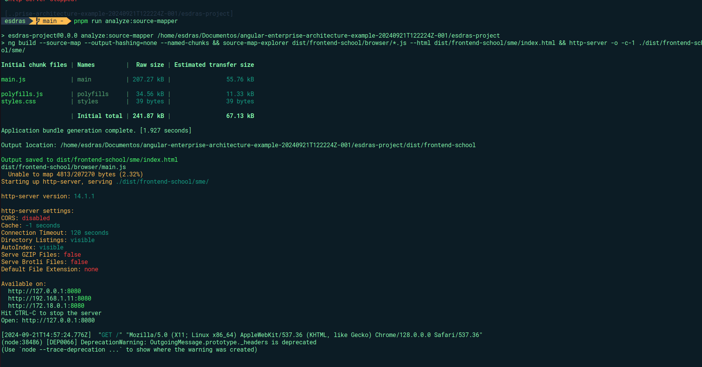

Ele é mais limitado em termos de visualizações interativas e recursos adicionais,
focando-se principalmente na exibição dos componentes do pacote com base nos mapas de fonte existentes.

enquanto o esbuild, gera um arquivo que pode ser visualizado tbm depois, pra identificarmos possiveis melhorias no tamanho do bundle
pelo site [analyze](https://esbuild.github.io/analyze/)


recomendo esses outros artigos que usei pra estudar, e que são excelentes.
[Fabio Zuin](https://medium.com/@fabiozuin/performance-you-should-keep-an-eye-on-your-bundle-constantly-and-here-is-how-40f0c00a64fb)
[Mohammedfahimullah ](https://mohammedfahimullah.medium.com/optimize-the-bundle-size-using-source-map-explorer-5e848850e578)
[Tim Deschryver](https://timdeschryver.dev/bits/optimize-your-bundle-size-with-source-map-explorer)
[Tomas Trajan](https://angularexperts.io/blog/top-10-angular-architecture-mistakes)
[Webpack Bundle](https://blog.jakoblind.no/webpack-bundle-analyzer/)
[Rose Waitherero Chege](https://www.debugbear.com/blog/webpack-bundle-analyzer)
[Matti Bar-Zeev](https://dev.to/mbarzeev/everything-you-need-to-know-about-webpacks-bundle-analyzer-g0l)

### Eslint

O ESLint é uma ferramenta de linting popular para códigos JavaScript e TypeScript.Ajuda os desenvolvedores
a identificar e corrigir problemas no código, como erros de sintaxe ou padrões
de codificação que não seguem as melhores práticas. Mantendo o padrão
em projetos grandes ou quando várias pessoas estão trabalhando no mesmo projeto. So que o eslint não
vem integrado por padrão no Angular CLI, so que é muito
facil adicionar e configurar o usando Angular schematics, que automatizam o processo de instalação
e configuração inicial.

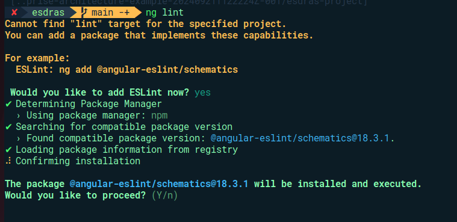

No webstorm pra configurar
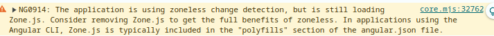

É o eslint ajuda pra caramba, nesse caso que eu implementei um lifecycle do componente
e não coloquei nada, ele ja apita que tem erro.


### Tamanho de pacote e build

Uma coisa que nunca parava pra pensar, em questão de frontend, era o tamanho do pacote,
sempre pensava em questão colocar lazy loading nos modulos, mas nunca olhava ferramentas que poderia me ajudar
em questão de analise do tamanho dos pacotes de uma aplicação no frontend, em pesquisas descobri 3 ferramentas
que que podem ser usadas para analisar o tamanho do pacote:

1. esbuild-visualizer: Bom para quem usa esbuild. Ele cria uns arquivos que precisam de um servidor tipo HTTP para você ver o que está acontecendo. Dá para ver tudo em formatos diferentes, como treemap, que é o mais comum.
2. source-map-explorer
   Adequado para: Qualquer projeto que produza mapas de fonte, mas é mais simples e não tão bonito quanto outros.
3. webpack-bundle-analyzer :É a mais usada, mas só vale para quem não tá no esbuild. Se seu projeto é antigo e usa webpack, essa é a ferramenta.

Essas ferramentas ajudam a manter a eficiência de sua aplicação ao permitir uma gestão cuidadosa do tamanho do pacote, essencial para otimizar os tempos de carga e melhorar a experiência geral de desenvolvimento.

vamos usar o esbuild e o source-map-explorer

```bash
pnpm install -D esbuild-visualizer source-map-explorer http-server
```

```bash
"analyze": "ng build --stats-json --output-hashing=none --named-chunks && esbuild-visualizer --template treemap --metadata dist/frontend-school/stats.json --filename dist/frontend-school/analyse/index.html  && http-server -o -c-1 ./dist/frontend-school/analyse/",
"analyze:sme": "ng build --source-map --output-hashing=none --named-chunks && source-map-explorer dist/frontend-school/browser/*.js --html dist/frontend-school/sme/index.html && http-server -o -c-1 ./dist/frontend-school/sme/",

```

Como podem ver, utilizamos um http server pra visualizar o tamanho dos arquivos incluidos no pacote e identificar quais modulos que são mais pesados.


conseguimos ver o source mapper, com o tamanho do bundle da aplicação


Ele é mais limitado em termos de visualizações interativas e recursos adicionais,
focando-se principalmente na exibição dos componentes do pacote com base nos mapas de fonte existentes.

enquanto o esbuild, gera um arquivo que pode ser visualizado tbm depois, pra identificarmos possiveis melhorias no tamanho do bundle
pelo site [analyze](https://esbuild.github.io/analyze/)

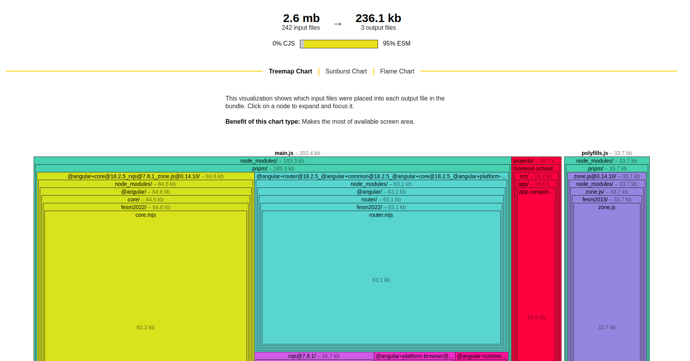

recomendo esses outros artigos que usei pra estudar, e que são excelentes.
[Fabio Zuin](https://medium.com/@fabiozuin/performance-you-should-keep-an-eye-on-your-bundle-constantly-and-here-is-how-40f0c00a64fb)
[Mohammedfahimullah ](https://mohammedfahimullah.medium.com/optimize-the-bundle-size-using-source-map-explorer-5e848850e578)
[Tim Deschryver](https://timdeschryver.dev/bits/optimize-your-bundle-size-with-source-map-explorer)
[Tomas Trajan](https://angularexperts.io/blog/top-10-angular-architecture-mistakes)
[Webpack Bundle](https://blog.jakoblind.no/webpack-bundle-analyzer/)
[Rose Waitherero Chege](https://www.debugbear.com/blog/webpack-bundle-analyzer)
[Matti Bar-Zeev](https://dev.to/mbarzeev/everything-you-need-to-know-about-webpacks-bundle-analyzer-g0l)

### Eslint

O ESLint é uma ferramenta de linting popular para códigos JavaScript e TypeScript.Ajuda os desenvolvedores
a identificar e corrigir problemas no código, como erros de sintaxe ou padrões
de codificação que não seguem as melhores práticas. Mantendo o padrão
em projetos grandes ou quando várias pessoas estão trabalhando no mesmo projeto. So que o eslint não
vem integrado por padrão no Angular CLI, so que é muito
facil adicionar e configurar o usando Angular schematics, que automatizam o processo de instalação
e configuração inicial.


<<<<<<< HEAD
=======

No webstorm pra configurar
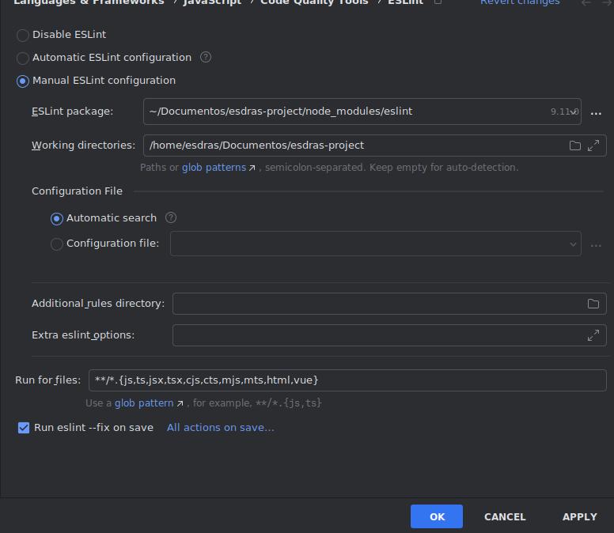

É o eslint ajuda pra caramba, nesse caso que eu implementei um lifecycle do componente

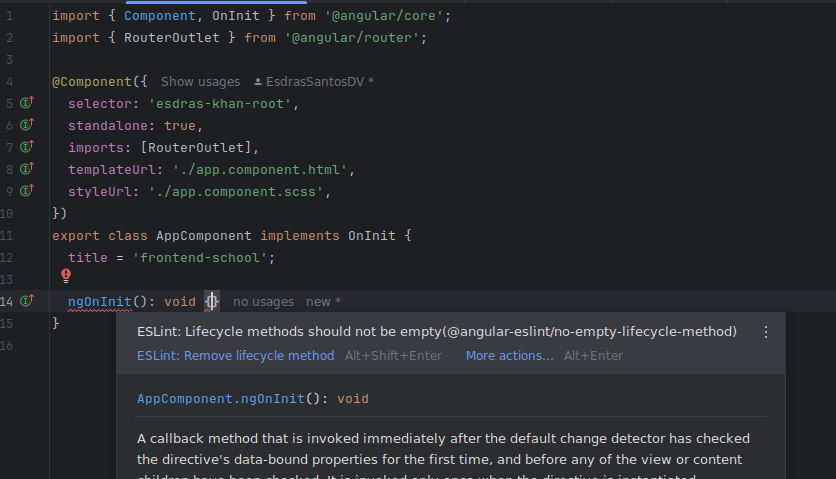

### Dependencias

A análise de grafo de dependência serve
para garantir que as dependências entre
módulos de um projeto sigam uma direção única,
sem criar loops ou ciclos.
Isso ajuda a manter o código organizado ,
fácil de manter e com menos risco de
erros ao adicionar ou modificar partes do sistema.

Pra isso vamos usar uma ferramenta que tem bastante adoção por meio da comunidade que é o
[madge](https://www.npmjs.com/package/madge)

pra instalar ela

```
pnpm i -D madge npm-run-all
```

e instalar no linux

```
sudo apt-get install graphviz

```

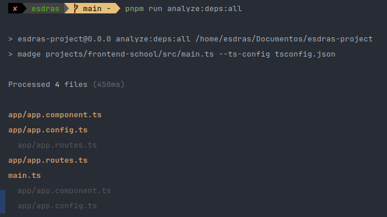

### Angular material

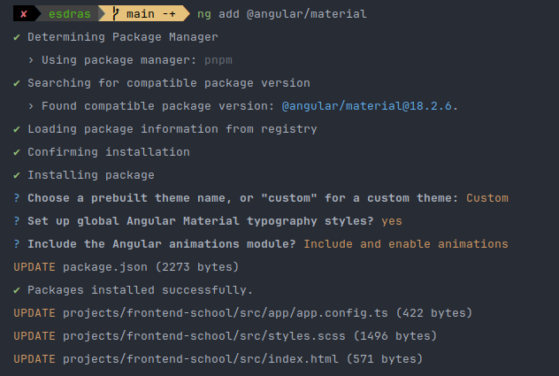

temos o builder


### Tailwind

``` bash
pnpm install -D tailwindcss postcss autoprefixer
```

Inicializar o tailwind

```bash
npx tailwindcss init -p
```

## Arquitetura

### Core

Na arquitetura que defini, o core é o centro da lógica compartilhada de serviços e o lugar responsável por manter a configuração e a lógica de um projeto Angular. Ele é acessível por qualquer parte das features da nossa aplicação, seja carregada de forma eager ou lazy.

Imagine, por exemplo, uma feature de pedidos que precisa buscar informações do backend ou acessar uma store específica. Nesse caso, o core desempenha um papel fundamental, fornecendo a lógica necessária para essa busca de dados. O core é o local onde concentramos nossos singletons, stores e a lógica de configuração do projeto.

Uma das principais responsabilidades do core é garantir que toda a lógica necessária para o funcionamento da aplicação desde o início, como estado de autenticação, interceptores e guards, esteja configurada corretamente. Essa lógica pode ser usada para realizar outras requisições backend, determinar o acesso de usuários a determinadas partes da aplicação ou até exibir informações antes mesmo do carregamento de uma funcionalidade lazy.

Além disso, o core é onde implementamos lógicas de domínio, especialmente quando essa lógica precisa ser compartilhada entre múltiplas features. Por exemplo, se temos um caso em que precisamos construir factories de dados, essa lógica também reside no core, permitindo que qualquer parte da aplicação consuma essas factories de maneira eficiente e centralizada.

Portanto, o core vai além de um simples agrupamento de serviços; ele é o ponto central de configuração, gerenciamento de estado e lógica compartilhada, assegurando que todos os recursos essenciais estejam disponíveis em toda a aplicação de forma consistente e escalável.

#Core

Com a estrutura standalone, o core torna-se ainda mais essencial, substituindo o antigo CoreModule pelo provideCore(), permitindo um gerenciamento muito mais eficiente das configurações que devem estar ativas desde o início da aplicação. O provideCore() é o local ideal para concentrar todas essas configurações essenciais, garantindo que tudo esteja centralizado, sem ambiguidade ou risco de omitir alguma configuração importante.

O provideCore() centraliza a configuração de todos os provedores globais do Angular, como provideAnimations(), provideRouter(), provideHttpClient() (com interceptores) e também bibliotecas de gerenciamento de estado, como o NgRx, através do provideStore(). APIs do tipo provideX também suportam configurações adicionais, permitindo personalizações que aprimoram as funcionalidades fornecidas.

Além disso, o provideCore() é o local ideal para registrar provedores de bibliotecas de terceiros que tratam de aspectos cruciais de infraestrutura, como logging, traduções, análises e outros serviços essenciais para a operação da aplicação. Com essa abordagem standalone, a organização e centralização dessas configurações tornam-se muito mais eficientes, unificando toda a lógica de infraestrutura.

Colocando a configuração de zoneless no angular

```ts
export function provideCore({ routes }: CoreOptions) {
  return [
    provideExperimentalZonelessChangeDetection(),

```

so que recebmos um erro no navegador, dizendo que precisamos remover o zone.js do polyfil

precisamos remover o zones js do polyfil

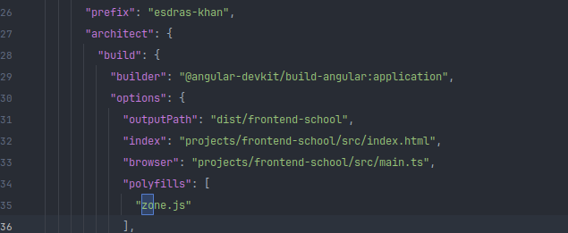

### Transloco

``` bash
ng add @jsverse/transloco
```

e configurar no core as linguagens, podemos tambem fazer um setup de companhias
e cada companhia ter o seu determinado texto
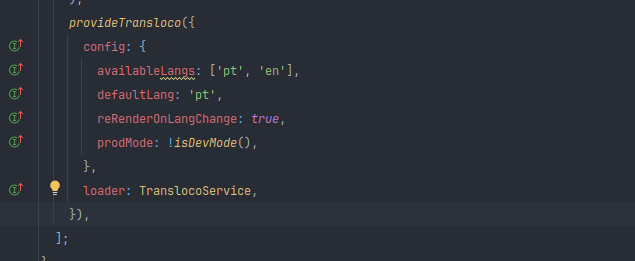

### NGRX

```bash
 ng add @ngrx/store@latest    
 ng add @ngrx/store-devtools@latest
 ng add @ngrx/signals@latest
 ng add @ngrx/operators@latest
 ng add @ngrx/eslint-plugin
 ng add @ngrx/schematics@latest
 ng add @ngrx/router-store@latest
```

gosto dessas configuraçoes

```ts
  provideStore(),
  provideStoreDevtools({
    maxAge: 25,
    logOnly: !isDevMode(),
    autoPause: true,
    trace: true,
    traceLimit: 75,
  }),
  provideRouterStore(),
```

### Keycloak Angular

ter um ambiente com o keycloak, nesse caso, usei um docker pra subir o keycloak
e configurei o realm e o client no keycloak, coloquei uma pasta na raiz desse projeto
com um compose, pra subir o keycloak, peguei na propria documentação do keycloak angular,
posteriormente, realizarei um artigo sobre como subir o keycloak pra nuvem

```docker
version: '3'
services:
  keycloak:
    image: quay.io/keycloak/keycloak:25.0.0
    environment:
      KEYCLOAK_ADMIN: admin
      KEYCLOAK_ADMIN_PASSWORD: admin
    ports:
      - 8080:8080
    volumes:
      - ./config/:/opt/keycloak/data/import:ro
    entrypoint: '/opt/keycloak/bin/kc.sh start-dev --import-realm'
```

depois disso abrir o localhost:8080 e logar com o admin e a senha admin


entramos na tela de configuração do keycloak

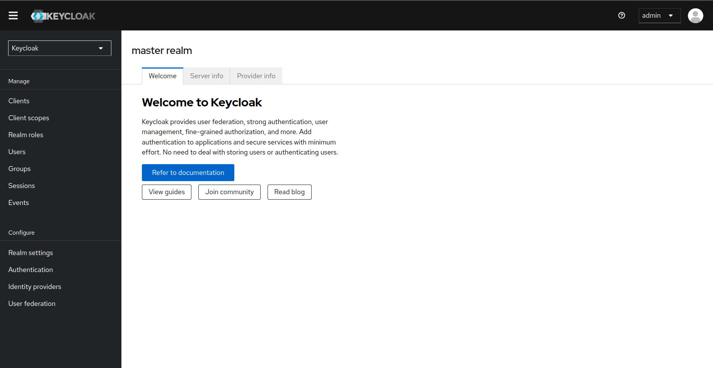

vamos criar nosso reino

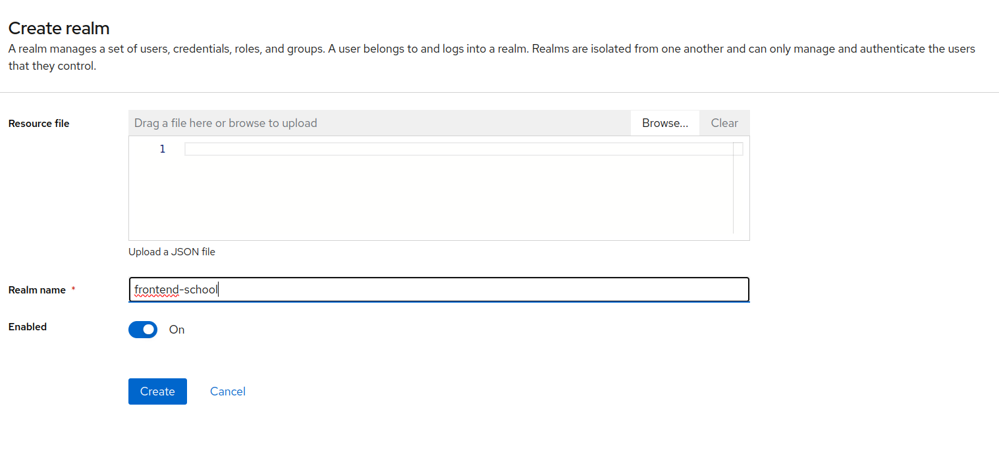
na opcao do menu a direita, vamos em add realm

depois disso, nos criamos nosso client, e salvamos nosso client id pra posteriormente
configurar no frontend
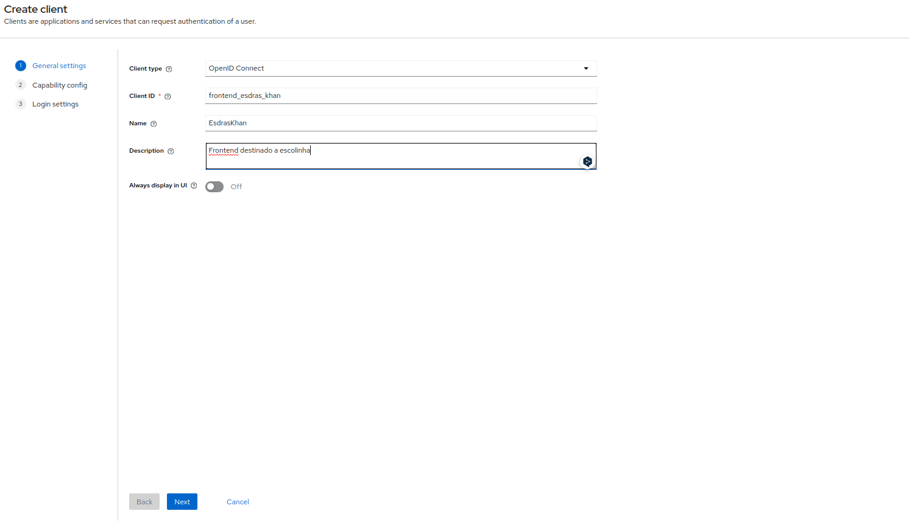
deixamos por padrão


colocamos as url de redirecionamento

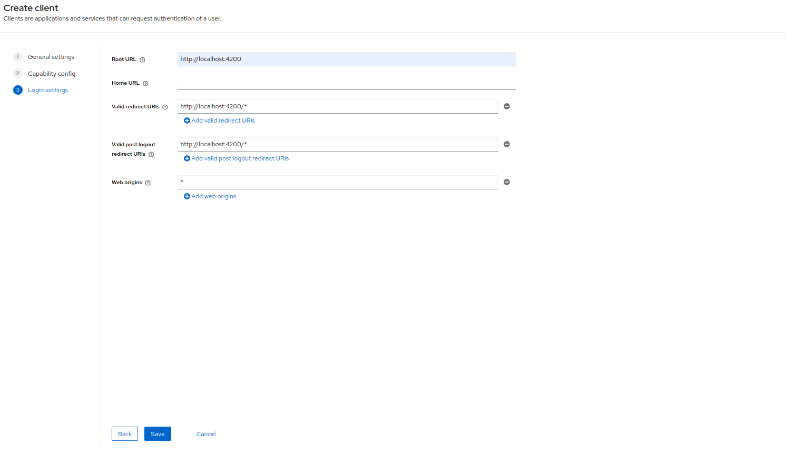

criar o usuario

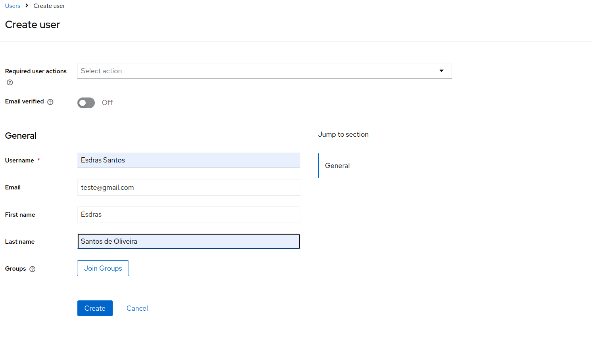

colocar a senha
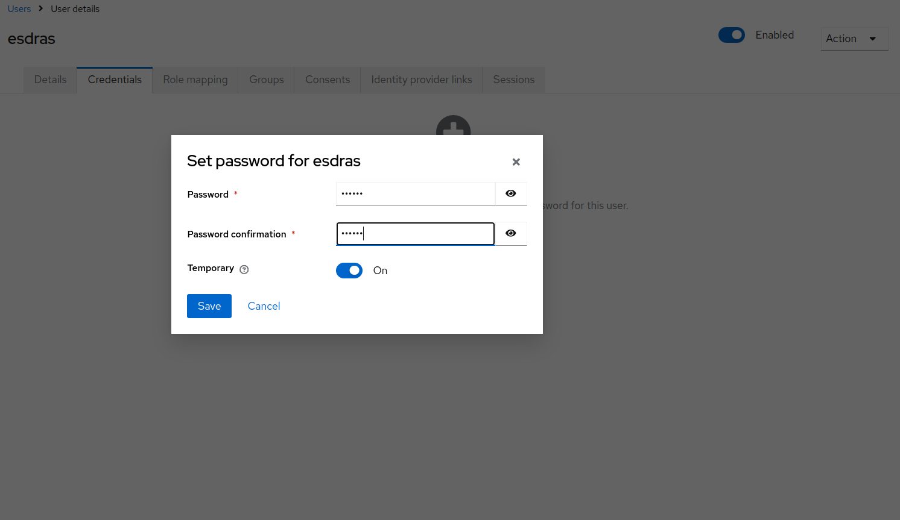

```bash
pnpm  i keycloak-angular
pnpm i keycloak-js

```

depois de instalar e so criar um arquivo html na pasta assets

```html

<html>
<body>
<script>
  parent.postMessage(location.href, location.origin);
</script>
</body>
</html>
```

e configurar o init do keycloak

```ts
import { KeycloakService } from 'keycloak-angular';
import { environment } from '../../../environments/environment';

export function initializeKeycloak(keycloak: KeycloakService) {
  return async () =>
    keycloak.init({
      config: {
        url: environment.keycloak.authority,
        realm: environment.keycloak.realm,
        clientId: environment.keycloak.clientId,
      },
      loadUserProfileAtStartUp: true,
      initOptions: {
        onLoad: 'check-sso',
        silentCheckSsoRedirectUri: window.location.origin + '/silent-check-sso.html',
        checkLoginIframe: false,
        redirectUri: environment.keycloak.redirectUri,
      },
    });
}

```

depois
quando
rodar
o
projeto, pedira
pra
logar, e
depois
de
logar, vai
redirecionar
pra
pagina
principal

vi
alguns
desenvolvedores
tendo
dificuldade
em
configurar
o
keycloak, com
standalone,
o
segredo
e
pra
nessas
situaçoes
que
exigirem
modulos
colocar
o
importProvidersFrom

  ``` tipescript
 importProvidersFrom([KeycloakAngularModule]),
    {
      provide: APP_INITIALIZER,
      useFactory: initializeKeycloak,
      multi: true,
      deps: [KeycloakService],
    },
```

e temos um serviço construido

```ts
import { inject, Injectable } from '@angular/core';
import { KeycloakService } from 'keycloak-angular';
import { KeycloakProfile } from 'keycloak-js';
import { environment } from '../../../environments/environment';

@Injectable({
  providedIn: 'root',
})
export class AuthKeycloakService {
  readonly keycloakService = inject(KeycloakService);

  redirectToLoginPage(): Promise<void> {
    return this.keycloakService.login();
  }

  getUserName() {
    return this.keycloakService.getUsername();
  }

  async loadUserProfile(): Promise<KeycloakProfile> {
    return await this.keycloakService.loadUserProfile();
  }

  isLoggedIn(): boolean {
    return this.keycloakService.isLoggedIn();
  }

  logout(): void {
    this.keycloakService.logout(environment.keycloak.postLogoutRedirectUri);
  }
}
```

### Setup simples de variaveis de ambiente

criar no source do projeto um arquivo de enviroment de prod, e de dev, depois vou ensinar como
fazer o ci e cd, e subir na nuvem

```ts
//DEV
export const environment = {
  production: true,
  keycloak: {
    authority: 'http://localhost:8080',
    redirectUri: 'http://localhost:4200',
    postLogoutRedirectUri: 'http://localhost:4200/logout',
    realm: 'frontend-school',
    clientId: 'frontend_esdras_khan',
  },
};
//PROD
export const environment = {
  production: true,
  keycloak: {
    authority: 'PRODUCTION',
    redirectUri: 'PRODUCTION',
    postLogoutRedirectUri: 'PRODUCTION',
    realm: 'PRODUCTION',
    clientId: 'PRODUCTION',
  },
};
```

e lembrar de colocar no angular.json

```json
   "development": {
"optimization": false,
"extractLicenses": false,
"sourceMap": true,
"fileReplacements": [
{
"replace": "projects/frontend-school/src/environments/environment.ts",
"with": "projects/frontend-school/src/environments/environment.development.ts"
}
]
}
```

o interceptor

```ts

import { HttpHeaders, HttpInterceptorFn } from '@angular/common/http';
import { inject } from '@angular/core';
import { AuthKeycloakService } from '../../keycloak/keycloak.auth.service';

export const authInterceptor: HttpInterceptorFn = (req, next) => {
  const authService = inject(AuthKeycloakService);
  const authToken = authService.getToken();
  if (!authToken) {
    return next(req);
  }
  const authReq = req.clone({
    headers: new HttpHeaders({
      Authorization: `Bearer ${authToken}`,
    }),
  });
  return next(authReq);
};

```


### FUNÇÕES PURAS

# Funções Puras e Memorização

## O que são Funções Puras?

Funções puras são blocos atômicos da programação funcional. Elas são adoradas por sua simplicidade e testabilidade.

Uma função é considerada pura se obedecer a duas regras:
1. **A mesma entrada (input) sempre retorna a mesma saída (output).**
2. **Ela não possui efeitos colaterais (side-effects).**

### 1. **Mesma Entrada => Mesma Saída**
Compare os seguintes exemplos:

#### **Exemplo de Função Pura**
```javascript
const add = (x, y) => x + y;
console.log(add(2, 4)); // Sempre retorna 6
```

#### **Exemplo de Função Impura**
```javascript
let x = 2;
const add = (y) => {
  x += y;
};
add(4); // x === 6 (primeira execução)
add(4); // x === 10 (segunda execução)
```
A primeira função sempre retorna o mesmo valor para a mesma entrada. A segunda depende do estado externo e pode retornar valores diferentes.

### 2. **Sem Efeitos Colaterais (Side-Effects)**

Efeitos colaterais ocorrem quando uma função modifica algo fora do seu escopo. Exemplos incluem:
- Alterar variáveis globais.
- Realizar chamadas HTTP.
- Modificar o DOM.
- Escrever no console (exemplo abaixo).

```javascript
const dobroImpuro = (x) => {
  console.log('dobrando', x);
  return x * 2;
};
const resultado = dobroImpuro(4);
console.log({ resultado });
```
O `console.log` é um efeito colateral. Ainda que não quebre a função, pode ser problemático em testes e execuções paralelas.

#### **Mutando um objeto (impuro)**
```javascript
const assocImpuro = (key, value, object) => {
  object[key] = value;
};
const pessoa = { nome: 'Bob' };
assocImpuro('tamanhoDoTenis', 40, pessoa);
console.log(pessoa); // pessoa foi modificada permanentemente
```

#### **Versão pura da função**
```javascript
const assocPuro = (key, value, object) => ({
  ...object,
  [key]: value
});
const pessoa = { nome: 'Bob' };
const resultado = assocPuro('tamanhoDoTenis', 40, pessoa);
console.log({ pessoa, resultado }); // pessoa continua intocada
```

A função `assocPuro` cria uma nova cópia do objeto original ao invés de modificá-lo diretamente.

---

## **Memorização (Memoization)**

A memorização é uma técnica de otimização que armazena os resultados de chamadas de funções para evitar recomputação.

### **Exemplo Simples de Memorização**
```javascript
const memoize = (fn) => {
  const cache = {};
  return (...args) => {
    const key = JSON.stringify(args);
    if (cache[key]) return cache[key];
    const result = fn(...args);
    cache[key] = result;
    return result;
  };
};

const slowFunction = (num) => {
  console.log('Computando...');
  return num * 2;
};

const fastFunction = memoize(slowFunction);
console.log(fastFunction(5)); // Computando... 10
console.log(fastFunction(5)); // Retorna 10 instantaneamente sem recomputar
```

Aqui, a segunda chamada para `fastFunction(5)` retorna instantaneamente porque o valor já está armazenado no cache.

---
# Funções Puras e Memorização

## O que são Funções Puras?

# Funções Puras e Memorização

## O que são Funções Puras?

Funções puras são blocos atômicos da programação funcional. Elas são adoradas por sua simplicidade e testabilidade.

Uma função é considerada pura se obedecer a duas regras:
1. **A mesma entrada (input) sempre retorna a mesma saída (output).**
2. **Ela não possui efeitos colaterais (side-effects).**

## **Exercícios: Identifique Funções Puras e Impuras**

Determine se as funções abaixo são puras ou impuras e justifique sua resposta:

```javascript
// 1. Retorna a data atual
function getDate() {
  return new Date().toDateString();
}

// 2. Retorna uma data fixa
function getWorkshopDate() {
  return new Date(2020, 11, 4).toDateString();
}

// 3. Converte um número para hexadecimal
function toHex(n) {
  let hex = n.toString(16);
  return hex.padStart(2, '0');
}

// 4. Converte RGB para HEX
function rgbToHex(R, G, B) {
  return '#' + [toHex(R), toHex(G), toHex(B)].join('');
}

// 5. Lê um arquivo JSON da web
async function readJsonFile(filename) {
  const file = await fetch('https://api.exemplo.com/data.json');
  return await file.json();
}

// 6. Calcula uma tabela verdade
function computeTruthTable(operator) {
  const truthValues = [true, false];
  const table = [];
  for (const A of truthValues) {
    for (const B of truthValues) {
      const value = operator(A, B);
      table.push({ A, B, value });
    }
  }
  return table;
}

// 7. Exibe uma tabela verdade no console
function showTruthTable(operator) {
  console.table(computeTruthTable(operator));
}

// 8. Retorna um número aleatório
function randomNumber() {
  return Math.random();
}

// 9. Eleva um número ao quadrado
function square(x) {
  return x * x;
}

// 10. Adiciona um valor a uma variável global
let total = 0;
function addToTotal(x) {
  total += x;
}

// 11. Multiplica dois números
function multiply(a, b) {
  return a * b;
}

// 12. Modifica um objeto global
const user = { name: 'Alice', age: 25 };
function updateUserAge(newAge) {
  user.age = newAge;
}

// 13. Concatena duas strings
function concatStrings(a, b) {
  return a + b;
}

// 14. Modifica um array global
let numbers = [1, 2, 3];
function addNumberToArray(n) {
  numbers.push(n);
}

// 15. Retorna um novo array com um número adicionado
function addNumberPurely(arr, n) {
  return [...arr, n];
}

// 16. Remove o último elemento de um array global
let items = [1, 2, 3, 4];
function removeLastItem() {
  items.pop();
}

// 17. Retorna um novo array sem o último elemento
function removeLastItemPurely(arr) {
  return arr.slice(0, -1);
}

// 18. Modifica um objeto passado como parâmetro
function updateObject(obj, key, value) {
  obj[key] = value;
}

// 19. Retorna uma cópia modificada de um objeto
function updateObjectPurely(obj, key, value) {
  return { ...obj, [key]: value };
}

// 20. Gera um ID único com base no tempo
function generateUniqueId() {
  return Date.now() + Math.random().toString(16);
}

// 21. Verifica se um número é par
function isEven(n) {
  return n % 2 === 0;
}

// 22. Modifica um array global removendo um elemento específico
let fruits = ['apple', 'banana', 'grape'];
function removeFruit(fruit) {
  const index = fruits.indexOf(fruit);
  if (index !== -1) {
    fruits.splice(index, 1);
  }
}

// 23. Retorna um novo array sem um elemento específico
function removeFruitPurely(fruitList, fruit) {
  return fruitList.filter(f => f !== fruit);
}

// 24. Loga um valor no console
function logMessage(message) {
  console.log(message);
}

// 25. Soma os números de um array
function sumArray(numbers) {
  return numbers.reduce((sum, num) => sum + num, 0);
}

// 26. Adiciona um item a um Set global
let userIds = new Set();
function addUserId(id) {
  userIds.add(id);
}

// 27. Retorna um novo Set com um item adicionado
function addUserIdPurely(set, id) {
  return new Set([...set, id]);
}

// 28. Faz uma requisição HTTP para obter dados
async function fetchUserData(userId) {
  const response = await fetch(`https://api.example.com/users/${userId}`);
  return await response.json();
}

// 29. Retorna um novo objeto mesclando dois objetos
function mergeObjects(obj1, obj2) {
  return { ...obj1, ...obj2 };
}

// 30. Altera uma variável global dentro da função
let counter = 0;
function incrementCounter() {
  counter++;
}
```

**Tarefa:** Para cada função acima, determine se ela é **pura** ou **impura** e justifique sua resposta.


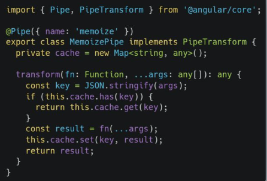


## **Resumo**

✅ **Funções Puras:**
- Sempre retornam a mesma saída para a mesma entrada.
- Não possuem efeitos colaterais.

❌ **Funções Impuras:**
- Dependem de variáveis externas.
- Modificam o estado global.
- Têm efeitos colaterais imprevisíveis.

🚀 **Memorização:**
- Evita computação repetitiva.
- Armazena valores de chamadas anteriores.
- Melhora a performance em funções custosas.

---

## **Conclusão**

Usar funções puras torna o código mais previsível, testável e manutenável. A memorização é uma estratégia poderosa para otimizar cálculos repetitivos.

Ao projetar funções, priorize a imutabilidade e a previsibilidade para garantir um sistema robusto e eficiente.

---

### Rxjs

🚀 Explorando Observáveis e RxJS no Angular

🧐 O que é um Observável?

Antes de tudo, vamos direto ao ponto: Observáveis são uma forma poderosa de lidar com fluxos de dados assíncronos no Angular. Mas o que isso significa na prática? Se você já usou ActivatedRoute para pegar parâmetros de rota, já teve contato com observáveis sem nem perceber!

O Angular usa RxJS para gerenciar esses fluxos de forma eficiente. Mas será que realmente precisamos usar observáveis? A resposta curta: não obrigatoriamente. Porém, se você quer lidar bem com eventos, requisições HTTP e estados reativos, observáveis são um caminho sem volta. 😎

🤔 Por que observar observáveis?

Muita gente se pergunta: O que torna os observáveis tão especiais? Para entender, imagine um app que depende de dados externos (exemplo: API, eventos do usuário ou até WebSockets). Sem observáveis, você teria que gerenciar estados manualmente, criar estruturas complexas para manipular dados e provavelmente lidar com muitos bugs. Com RxJS, esse trabalho fica mais declarativo e fluido.

Se você ainda não pegou o conceito de primeira, tudo bem! Não precisa absorver 100% agora. A ideia é dar um primeiro contato para que, conforme você pratica, as peças do quebra-cabeça comecem a se encaixar. 🧩

🔬 Vamos aprofundar?

Aqui, vamos criar nossos próprios observáveis do zero. Mas calma! No dia a dia, você dificilmente precisará fazer isso, já que o RxJS já tem tudo pronto para você. No entanto, entender a base te ajudará a desbloquear um novo nível de conhecimento sobre como essa ferramenta funciona nos bastidores. E isso faz total diferença! 🚀

🎭 Analogias para entender Observáveis

Aprender sobre observáveis pode parecer abstrato, então aqui vão algumas analogias para tornar a compreensão mais intuitiva:

1️⃣ Netflix & Streaming 📺

Imagine que você assina um serviço de streaming (como Netflix ou Spotify). Você não baixa todo o conteúdo de uma vez, apenas recebe os episódios ou músicas conforme dá play.

Um observável funciona assim: você se inscreve (subscribe) e ele te fornece os dados conforme vão chegando.

2️⃣ Encanamento de água 🚰

A água sai da fonte (por exemplo, uma estação de tratamento) e segue por tubulações até chegar na sua torneira.

O fluxo de dados em um observável segue o mesmo conceito: a fonte gera os dados e eles percorrem o pipeline (stream) até o destino, que pode ser seu template Angular.

3️⃣ Cafeteria & Pedido de Café ☕

Você chega na cafeteria e faz um pedido. O atendente te dá um número e pede para esperar ser chamado.

Enquanto isso, o barista prepara seu café. Quando estiver pronto, alguém chama seu número e você recebe seu pedido.

Observáveis trabalham assim: você se inscreve (subscribe) e aguarda os dados serem emitidos assim que estiverem prontos.

🎯 O que vem por aí?

Agora que você já tem uma noção inicial, vamos para a parte prática! No próximo módulo, vamos aprender:
✅ Criar observáveis manualmente;
✅ Manipular fluxos de dados com operadores RxJS;
✅ Trabalhar com subscribe e unsubscribe corretamente;
✅ Aplicar observáveis no contexto do Angular.

Pronto para começar? 🎬🔥

📌 Observáveis e o Método complete()

Com uma implementação adequada de um observable no RxJS, o método complete() garante que nenhum dado adicional seja emitido após sua execução. No exemplo acima, chamar complete() apenas dispara uma mensagem de log, mas ainda permitiria chamadas ao método next(). No entanto, em um observable real, isso não seria permitido — uma vez que complete() é chamado, o fluxo de dados é encerrado.

Nossa função myObservable$ pode emitir valores conforme necessário, chamando next() para notificar o observer sobre os dados gerados. Para utilizar esse observable, precisamos nos inscrever (subscribe) e passar um observer.

Nosso exemplo simplificado de um observable não implementa um método subscribe() como faríamos normalmente. No RxJS, a forma convencional seria algo como:
``` ts
const myObservable$ = (observer) => {

}//Percebeu o $no final do nome do observable? Isso não faz nada. É apenas uma convenção para indicar que essa variável é um observable. 

const observer = {
    next: (data) => console.log('My next was called with', data),
    complete: () => console.log('The observable has finished emitting data'),
    error: (err) => console.log('The following error ocurred', err)
}


const myObservable$ = (observer) => {
    observer.next(1);
    observer.next(2);
    observer.next(3);
    observer.next(4);
    observer.next(5);
    observer.complete();
}

myObservable$.subscribe((value)=>console.log(value))

```
No começo, dissemos que o papel de um observável é conectar um produtor de valores a um ou mais observadores desses valores. Podemos reutilizar o myObservable$que criamos acima com vários observadores diferentes se quisermos (ou podemos chamá-lo várias vezes com o mesmo observador):

```ts
const observerOne = {
    next: (data) => console.log('My next was called with', data),
    complete: () => console.log('The observable has finished emitting data'),
    error: (err) => console.log('The following error ocurred', err)
}

const observerTwo = {
    next: (data) => console.log('Double the data double the fun!', data * 2),
    complete: () => console.log('The observable has finished emitting data'),
    error: (err) => console.log('The following error ocurred', err)
}

const observerThree = {
    next: (data) => console.log('You call that doubling?', data, data),
    complete: () => console.log('The observable has finished emitting data'),
    error: (err) => console.log('The following error ocurred', err)
}

myObservable$(observerOne);
myObservable$(observerTwo);
myObservable$(observerThree);
myObservable$(observerOne);
```

🚀 Mantendo o Fluxo Reativo

Quando subscribemos um fluxo, estamos retirando seus valores para usá-los fora da lógica reativa. No entanto, dentro da aplicação, é essencial manter os dados fluindo sem interrupções. Uma vez que os dados saem do fluxo reativo, não podem mais reagir automaticamente a mudanças — qualquer atualização precisa ser feita manualmente, de forma imperativa (mais sobre isso depois!).

Nosso objetivo é sempre manter um fluxo ininterrupto até o destino final dos dados. Esse é o grande poder da programação reativa: transformar e manipular os dados enquanto eles percorrem o fluxo, sem precisar gerenciá-los de forma manual.


Acabamos de olhar para uma versão simplificada demais de um observable que usa apenas uma função simples. Agora, vamos criar uma implementação um pouco mais realista usando uma classe com um método subscribe, assim como um observable real. Essa implementação ainda é simplificada, pois não inclui complete e error, nem a capacidade de unsubscribe.

```ts 

interface Observer {
  next: (value: any) => void;
  error: (err: any) => void;
  complete: () => void;
}

class Observable {
  constructor(private _subscribe: (observer: Observer) => void) {}

  subscribe(observer: Observer) {
    this._subscribe(observer);
  }
}
const emitOneToFive$ = new Observable((observer) => {
  observer.next(1);
  observer.next(2);
  observer.next(3);
  observer.next(4);
  observer.next(5);
});

constructor(private _subscribe: (observer: Observer) => void) {}
(observer) => {
  observer.next(1);
  observer.next(2);
  observer.next(3);
  observer.next(4);
  observer.next(5);
}
```
Como Funciona?

1️⃣ O construtor da classe recebe uma função que aceita um observer e a armazena como _subscribe.

2️⃣ Essa função (_subscribe) será chamada apenas quando subscribe for acionado.

3️⃣ Cada vez que chamamos observer.next(), emitimos um novo valor para o fluxo.

4️⃣ O observable não faz nada até ser assinado, garantindo um fluxo sob demanda.

Agora, podemos assinar esse observable e ver os valores sendo emitidos:

emitOneToFive$.subscribe({
    next: (value) => console.log(value),
    error: (err) => console.error(err),
    complete: () => console.log('Observable completo!')
});


### SUBJECTS
🔥 O Que é um Subject?

No RxJS, temos dois tipos principais de observáveis: Cold (Unicast) e Hot (Multicast).

Cold Observables (Unicast): Cada assinatura cria um novo fluxo de dados, ou seja, cada assinante recebe sua própria instância dos valores emitidos.

Hot Observables (Multicast): Todos os assinantes compartilham o mesmo fluxo de dados, sem criar novas instâncias.

🌡️ Subject: Um Observable Especial

Um Subject é um tipo especial de Observable que permite multicasting. Isso significa que:
✅ Pode ser tratado como um Observable normal (pode ser subscribed)
✅ Também pode ser tratado como um Observer (podemos chamar next, error, complete diretamente nele)
✅ Compartilha os valores emitidos entre múltiplos assinantes

A principal diferença entre um Observable comum e um Subject está na origem dos dados.

🔄 Cold vs. Hot: O Papel do Subject

Vamos revisar os dois tipos de fluxo de dados com exemplos práticos.

🔹 Criando um Cold Observable (Unicast)

const emitOneToFive$ = new Observable((observer) => {
  observer.next(1);
  observer.next(2);
  observer.next(3);
  observer.next(4);
  observer.next(5);
});

Cada vez que assinamos (subscribe), um novo fluxo é criado. Isso significa que cada assinante recebe sua própria sequência de valores.

Agora, vejamos a diferença ao usar um Subject.

🔸 Criando um Hot Observable (Multicast) com Subject

const emitOneToFive$ = new Subject();

A diferença aqui é que o Subject não contém lógica interna para produzir valores. Em vez disso, os valores são gerados externamente e enviados via next().

emitOneToFive$.subscribe({
    next: (value) => console.log(`Subscriber 1: ${value}`)
});

Se chamarmos emitOneToFive$.next(1), veremos:

Subscriber 1: 1

Agora, se adicionarmos outro assinante depois de já termos emitido valores:

emitOneToFive$.subscribe({
    next: (value) => console.log(`Subscriber 2: ${value}`)
});

O que o segundo assinante receberá?

👉 Nada! Como o Subject é um fluxo hot, ele não “replay” valores antigos para novos assinantes. Apenas os assinantes ativos no momento da emissão recebem os valores.

📌 Quando Usar Subjects?

✅ Quando queremos que múltiplos assinantes compartilhem o mesmo fluxo de dados.
✅ Quando precisamos emitir valores manualmente dentro do fluxo.
✅ Quando estamos lidando com eventos globais dentro da aplicação.

```ts
export interface Observer {
  next: (value: any) => void;
  error: (err: any) => void;
  complete: () => void;
}

export class Subject {
  private observers: Observer[] = [];

  subscribe(observer: Observer) {
    this.observers.push(observer);
  }

  next(data: any) {
    for (const observer of this.observers) {
      observer.next(data);
    }
  }

  error(err: any) {
    for (const observer of this.observers) {
      observer.error(err);
    }
  }

  complete() {
    for (const observer of this.observers) {
      observer.complete();
    }
  }
}

```


No próximo módulo, vamos mergulhar em como os operadores RxJS ajudam a modificar e controlar esses fluxos de maneira elegante. 🌊⚡


🚀 Explorando RxJS na Prática

Agora que já mergulhamos na teoria dos Observables, vamos dar um passo adiante e explorar os Observables do RxJS na prática! O RxJS nos fornece Observables prontos para uso, além de uma infinidade de operadores úteis para lidar com qualquer situação que você possa encontrar.

Se você compreendeu bem a teoria na última lição, vai perceber que o RxJS é basicamente Observables + uma série de funcionalidades extras para facilitar o trabalho com esses fluxos de dados.

🎯 Criando Observables com RxJS

A forma de criar um Observable com RxJS é semelhante à implementação manual que fizemos anteriormente. Veja:

import { Observable } from 'rxjs';

const myObservable$ = new Observable(subscriber => {
  subscriber.next(1);
  subscriber.next(2);
  subscriber.next(3);
  subscriber.next(4);
  subscriber.next(5);
  subscriber.complete();
});

🔹 Como usar?

Podemos assinar esse Observable para capturar os valores emitidos:

const observer = {
    next: (data) => console.log('Recebido:', data),
    complete: () => console.log('Observable finalizado!'),
    error: (err) => console.log('Erro:', err)
};

myObservable$.subscribe(observer);

Ou de uma forma mais simples:

myObservable$.subscribe(data => console.log(data));

🔥 Operadores de Criação

O RxJS vem com mais de 100 operadores que podem criar ou transformar fluxos observáveis. Existem dois tipos principais:

1️⃣ Operadores de Criação: Criam novos observáveis.
2️⃣ Operadores Pipeables: Transformam observáveis existentes sem alterá-los diretamente.

Vamos analisar alguns exemplos!
```TS
🔹 Criando Observables com from

Podemos utilizar o operador from para transformar um array em um Observable:

import { from } from 'rxjs';

const myObservable$ = from([1, 2, 3, 4, 5]);

myObservable$.subscribe(value => console.log(value));

Saída esperada:

1
2
3
4
5

O operador from pode ser utilizado com arrays, Promises, iteráveis e até outros Observables!

🔹 Criando Observables com of

Se quisermos criar um Observable que emita um único valor, podemos usar of:

import { of } from 'rxjs';

const myObservable$ = of([1, 2, 3, 4, 5]);

myObservable$.subscribe(value => console.log(value));

Diferente de from, aqui o array é tratado como um único valor, então a saída será:

[1, 2, 3, 4, 5]

O operador of é útil quando queremos criar fluxos contendo valores únicos, como strings ou objetos:

const myValue$ = of('Hello, RxJS!');
myValue$.subscribe(console.log);

Saída:

Hello, RxJS!
```
🔄 Transformando Observables com pipe

Além de criar Observables, podemos modificar seus valores antes de consumi-los, utilizando operadores pipeable.

🔹 O método pipe permite encadear transformações no fluxo de dados. Veja um exemplo utilizando map e filter:


```TS
import { map, filter } from 'rxjs/operators';

myObservable$.pipe(
    map(value => value * 2),  // Multiplica os valores por 2
    filter(value => value < 7) // Filtra apenas valores menores que 7
).subscribe(value => console.log(value));

Se myObservable$ emite:

1
2
3
4
5

A saída será:

2
4
6

👉 O operador map transformou os valores multiplicando-os por 2.
👉 O operador filter filtrou valores maiores ou iguais a 7.

Isso mostra o poder da programação reativa e como conseguimos manipular fluxos de dados de forma declarativa e eficiente!


Operadores de Criação

O RxJS vem com mais de 100 operadores que podem criar ou transformar fluxos observáveis. Existem dois tipos principais:

1️⃣ Operadores de Criação: Criam novos observáveis.
2️⃣ Operadores Pipeables: Transformam observáveis existentes sem alterá-los diretamente.

Vamos analisar alguns exemplos!

🔹 Criando Observables com from

Podemos utilizar o operador from para transformar um array em um Observable:

import { from } from 'rxjs';

const myObservable$ = from([1, 2, 3, 4, 5]);

myObservable$.subscribe(value => console.log(value));

Saída esperada:

1
2
3
4
5

O operador from pode ser utilizado com arrays, Promises, iteráveis e até outros Observables!

🔹 Criando Observables com of

Se quisermos criar um Observable que emita um único valor, podemos usar of:

import { of } from 'rxjs';

const myObservable$ = of([1, 2, 3, 4, 5]);

myObservable$.subscribe(value => console.log(value));

Diferente de from, aqui o array é tratado como um único valor, então a saída será:

[1, 2, 3, 4, 5]

O operador of é útil quando queremos criar fluxos contendo valores únicos, como strings ou objetos:

const myValue$ = of('Hello, RxJS!');
myValue$.subscribe(console.log);

Saída:

Hello, RxJS!

🔄 Transformando Observables com pipe

Além de criar Observables, podemos modificar seus valores antes de consumi-los, utilizando operadores pipeable.

🔹 O método pipe permite encadear transformações no fluxo de dados. Veja um exemplo utilizando map, filter e tap:

import { map, filter, tap } from 'rxjs/operators';

myObservable$.pipe(
    tap(value => console.log("Antes do map:", value)),
    map(value => value * 2),  // Multiplica os valores por 2
    tap(value => console.log("Antes do filter:", value)),
    filter(value => value < 7) // Filtra apenas valores menores que 7
).subscribe(value => console.log("Stream emitido:", value));

Se myObservable$ emite:

1
2
3
4
5

A saída será:

Antes do map: 1
Antes do filter: 2
Stream emitido: 2
Antes do map: 2
Antes do filter: 4
Stream emitido: 4
Antes do map: 3
Antes do filter: 6
Stream emitido: 6
Antes do map: 4
Antes do filter: 8
Antes do map: 5
Antes do filter: 10

🛠️ Operadores Essenciais

startWith

Adiciona um valor inicial antes do primeiro valor emitido pelo Observable.

import { startWith } from 'rxjs/operators';

const myObservable$ = from([1, 2, 3]).pipe(
    startWith(0)
);

Saída esperada:

0
1
2
3

distinctUntilChanged

Evita que o mesmo valor consecutivo seja emitido.

import { distinctUntilChanged } from 'rxjs/operators';

const myObservable$ = from([1, 2, 3, 3, 2]).pipe(
    distinctUntilChanged()
);

Saída esperada:

1
2
3
2

debounceTime

Aguarda um tempo antes de emitir um valor para evitar execuções excessivas.

import { debounceTime } from 'rxjs/operators';

const myObservable$ = from([1, 2, 3]).pipe(
    debounceTime(200)
);

Saída esperada:?


```

Bora pros exercicios para fixação:


1️⃣ Qual operador devo usar?
❓ Dado um Observable que emite números de 1 a 10, como posso garantir que ele apenas emita os valores menores que 5?
💡 Saída esperada: 1, 2, 3, 4
🔎 Qual operador do RxJS deve ser usado?


2️⃣ Qual operador transforma os valores?
❓ Queremos um Observable que emite números de 1 a 5 e multiplica cada um por 3 antes de ser emitido.
💡 Saída esperada: 3, 6, 9, 12, 15
🔎 Qual operador do RxJS pode fazer isso?


3️⃣ Como atrasar a emissão de valores?
❓ Queremos um Observable que emite um valor, mas só deve ser recebido pelo assinante após 2 segundos.

Qual operador do Rxjs pode fazer isso?


4️⃣ Como eliminar valores repetidos consecutivos?
❓ Temos um Observable que emite os seguintes valores:
```
A, A, B, B, B, C, C, A, A, D
```

Queremos que ele emita apenas quando o valor realmente mudar.
💡 Saída esperada: A, B, C, A, D
🔎 Qual operador do RxJS deve ser usado?


5️⃣ Como criar um valor inicial no Observable?
❓ Temos um Observable que escuta mudanças em um campo de formulário, mas queremos que ele inicie já com um valor padrão ('hello').
💡 Exemplo:
```
hello
(novos valores digitados no campo)
mundo
RxJS
```
🔎 Qual operador do RxJS pode ser usado?


6️⃣ Como combinar dois Observables e pegar o último valor de cada um?
❓ Temos dois Observables, um que emite nomes e outro que emite idades. Queremos combinar ambos e emitir um objeto { nome, idade } quando qualquer um mudar.
💡 Exemplo:
```
{ nome: 'Alice', idade: 25 }
{ nome: 'Bob', idade: 25 }
{ nome: 'Bob', idade: 30 }
```
🔎 Qual operador do RxJS pode ser usado?


7️⃣ Como limitar a quantidade de emissões?
❓ Temos um Observable que emite números indefinidamente e queremos apenas os primeiros 3 valores.
💡 Saída esperada: 1, 2, 3
🔎 Qual operador do RxJS deve ser usado?


8️⃣ Como evitar requisições desnecessárias em tempo real?
❓ Estamos escutando as mudanças em um campo de busca e queremos esperar 300ms antes de emitir um novo valor, evitando requisições desnecessárias ao servidor.
💡 Exemplo:
```
(Usuário digita "Rx" rapidamente)
Nenhuma requisição disparada
(Usuário para de digitar por 300ms)
Requisição disparada: "Rx"
```
🔎 Qual operador do RxJS deve ser usado?


9️⃣ Como cancelar requisições antigas e manter apenas a mais recente?
❓ Temos um campo de busca que dispara requisições HTTP a cada alteração, mas queremos cancelar a requisição anterior caso o usuário digite novamente antes da resposta chegar.
💡 Exemplo:
```
Usuário digita "Rx" → Dispara requisição A
Usuário digita "RxJ" → Cancela requisição A e dispara requisição B
Usuário digita "RxJS" → Cancela requisição B e dispara requisição C
```
🔎 Qual operador do RxJS deve ser usado?

🔟 Como repetir a tentativa de uma requisição HTTP que falhou?
❓ Queremos fazer uma requisição HTTP e, caso ela falhe, tentar novamente até 3 vezes antes de mostrar um erro.
💡 Exemplo:

```
Tentativa 1: Erro
Tentativa 2: Erro
Tentativa 3: Sucesso!
```
🔎 Qual operador do RxJS pode ser usado?


1️⃣ Como reagir apenas ao primeiro valor diferente?
❓ Temos um Observable que escuta um input de formulário e queremos ignorar os valores repetidos, mas aceitar o primeiro valor diferente de cada vez.
💡 Exemplo:

```
Usuário digita: "hello" → Emitido
Usuário digita: "hello" → Ignorado
Usuário digita: "world" → Emitido
Usuário digita: "world" → Ignorado

```
🔎 Qual operador do RxJS pode ser usado?

2️⃣ Como dividir um Observable em dois fluxos diferentes?
❓ Temos um fluxo de números e queremos separar os valores pares e ímpares em dois Observables diferentes.
💡 Entrada: [1, 2, 3, 4, 5, 6]
💡 Saída esperada:
```
Pares: 2, 4, 6
Ímpares: 1, 3, 5
```
🔎 Qual operador do RxJS pode ser usado?


3️⃣ Como transformar um array emitido em múltiplos valores individuais?
❓ Temos um Observable que emite um array de números, mas queremos transformar cada item do array em uma emissão separada.
💡 Entrada: [1, 2, 3, 4, 5]
💡 Saída esperada:
```
1
2
3
4
5
```
🔎 Qual operador do RxJS pode ser usado?


4️⃣ Como combinar múltiplas requisições HTTP e esperar todas finalizarem antes de emitir o resultado?
❓ Queremos buscar dados de múltiplas APIs ao mesmo tempo e somente emitir o resultado quando todas as requisições forem concluídas.
💡 Exemplo:
```
Buscando usuário... ✅
Buscando pedidos... ✅
Buscando notificações... ✅
Emitindo resultado final!
```
🔎 Qual operador do RxJS pode ser usado?


5️⃣ Como repetir a emissão de valores indefinidamente?
❓ Queremos criar um Observable que emita os números de 1 a 5 repetidamente.
💡 Saída esperada:
```
1, 2, 3, 4, 5, 1, 2, 3, 4, 5, 1, 2, 3, ...
```
🔎 Qual operador do RxJS pode ser usado?


6️⃣ Como ignorar as primeiras emissões e pegar apenas as últimas?
❓ Temos um fluxo de números de 1 a 10 e queremos ignorar os 7 primeiros valores e emitir apenas os últimos 3.
💡 Saída esperada:
```
8, 9, 10
```
🔎 Qual operador do RxJS pode ser usado?


7️⃣ Como executar múltiplas requisições HTTP uma por vez?
❓ Temos um fluxo de IDs e queremos fazer uma requisição HTTP para cada um, mas garantir que apenas uma requisição rode por vez.
💡 Entrada: [1, 2, 3, 4]
💡 Saída esperada:
```
Requisição para ID 1 ✅
Requisição para ID 2 ✅
Requisição para ID 3 ✅
Requisição para ID 4 ✅
```
🔎 Qual operador do RxJS pode ser usado?


9️⃣ Como combinar os valores de dois Observables para emitir um novo valor processado?
❓ Temos dois Observables, um que emite temperaturas em Celsius e outro que emite umidade. Queremos combinar os dois e emitir um objeto com ambos os valores.
💡 Exemplo:
```
{ temperatura: 25, umidade: 60 }
{ temperatura: 30, umidade: 50 }
```

🔎 Qual operador do RxJS pode ser usado?


🔟 Como encadear Observables onde um depende da resposta do anterior?
❓ Temos um fluxo que emite IDs de usuários e precisamos buscar os detalhes desse usuário na API. Assim que a resposta chegar, queremos buscar os pedidos do usuário.
💡 Fluxo esperado:
```
ID recebido → Buscar usuário
Usuário carregado ✅ → Buscar pedidos
Pedidos carregados ✅ → Emitir resultado final
```
🔎 Qual operador do RxJS pode ser usado?

